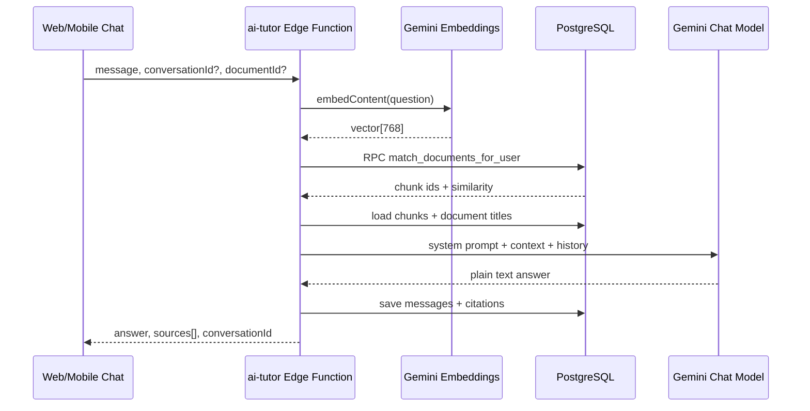

# Architecture: AI Chat (AI Tutor, RAG)

The **AI Tutor** is a **retrieval-augmented** chat: the student’s question is embedded, similar **chunks** are retrieved from **their own** documents via **pgvector**, and **Gemini** generates a **plain-text**, **grounded** answer. Conversations and citations are persisted for traceability and quota enforcement.

## Overview

**Edge Function:** `supabase/functions/ai-tutor/index.ts`

1. **Auth**: Verify JWT → `userId`.
2. **Entitlement**: Premium = unlimited; free = daily message cap (`AI_TUTOR_FREE_DAILY_LIMIT`, Manila-day window) with optional in-app notifications.
3. **Scope**: Optional `documentId` restricts retrieval to one document; must match conversation scope if continuing a thread.
4. **Embed question**: **Gemini** `gemini-embedding-001`, **768** dimensions (must match DB vector type).
5. **Retrieve**: RPC **`match_documents_for_user`** — cosine distance on `document_embeddings`, filtered by `user_id` and optional `document_id`.
6. **Answerability**: If no chunks above threshold, return a helpful message without LLM generation (still may save messages).
7. **Context build**: Fetch full `chunks` text + `documents.title`; build labeled context blocks and `SourceCitation[]`.
8. **History**: Last **4** messages from `chat_messages` for multi-turn coherence.
9. **Generate**: **Gemini** `gemini-2.5-flash-lite` with strict system rules (no markdown, cite sources, only use materials).
10. **Persist**: `chat_conversations`, `chat_messages` with `retrieved_chunk_ids`, `similarity_scores`, `source_citations`.

## Technologies

| Layer | Technology | Role |
|-------|------------|------|
| Vector store | **PostgreSQL** + **pgvector** | `document_embeddings.embedding vector(768)` |
| Similarity | Cosine distance operator `<=>` in SQL | `1 - (embedding <=> query_embedding)` as similarity |
| Retrieval RPC | `match_documents_for_user` | Security: join `documents` to enforce `user_id` |
| Query embedding | **Gemini** `gemini-embedding-001` | Same dimension as stored vectors |
| Answer LLM | **Gemini** `gemini-2.5-flash-lite` | Grounded tutor reply |
| Ingest of vectors | `process-document` Edge Function | Writes `document_embeddings` after chunking |

## End-to-End Flow



## Connection to the Rest of the System

| Area | Link |
|------|------|
| **Content extraction** | Embeddings created in `process-document`; no chunks → empty retrieval |
| **Quizzes / learning path** | Separate flows; mastery does not change tutor retrieval directly |
| **Analytics** | Not required for chat; usage may appear in product metrics separately |
| **Subscription** | Free daily cap enforced in edge function |

## Key Files

- `supabase/functions/ai-tutor/index.ts` — full RAG pipeline
- `supabase/migrations/016_ai_tutor_remediation.sql` — `match_documents_for_user`, `source_citations` column, triggers
- Client: search `ai-tutor` or `AiTutor` in `src/` for invoke helpers and chat UI

## Code Snippets

**Edge function header (intent and models):**

```1:28:d:\EduCoach\supabase\functions\ai-tutor\index.ts
/**
 * AI Tutor Edge Function — RAG Chat (Remediated)
 *
 * 1. Verifies user identity from JWT via Supabase Auth
 * 2. Embeds the student's question (gemini-embedding-001)
 * 3. Performs user-scoped vector search via match_documents_for_user()
 * 4. Fetches chunk/document context + recent conversation history
 * 5. Generates plain-text AI answer with inferred pedagogy level
 * 6. Persists messages + citation traceability
 * 7. Returns answer + source citations
 */
// ...
const GEMINI_MODEL = 'gemini-2.5-flash-lite'
const EMBEDDING_MODEL = 'gemini-embedding-001'
const EMBEDDING_DIMENSIONS = 768
```

**User-scoped vector RPC:**

```32:65:d:\EduCoach\supabase\migrations\016_ai_tutor_remediation.sql
CREATE OR REPLACE FUNCTION public.match_documents_for_user(
    query_embedding vector(768),
    p_user_id UUID,
    match_threshold FLOAT DEFAULT 0.7,
    match_count INT DEFAULT 5,
    filter_document_id UUID DEFAULT NULL
)
RETURNS TABLE (
    id UUID,
    document_id UUID,
    chunk_id UUID,
    content_preview TEXT,
    similarity FLOAT
)
LANGUAGE plpgsql
AS $$
BEGIN
    RETURN QUERY
    SELECT
        de.id,
        de.document_id,
        de.chunk_id,
        de.content_preview,
        1 - (de.embedding <=> query_embedding) AS similarity
    FROM public.document_embeddings de
    INNER JOIN public.documents d
        ON d.id = de.document_id
    WHERE
        d.user_id = p_user_id
        AND (filter_document_id IS NULL OR de.document_id = filter_document_id)
        AND 1 - (de.embedding <=> query_embedding) > match_threshold
    ORDER BY de.embedding <=> query_embedding
    LIMIT match_count;
END;
$$;
```

**Calling the RPC from the edge function (note threshold/count differ from migration defaults — edge uses 0.5 and 6):**

```172:181:d:\EduCoach\supabase\functions\ai-tutor\index.ts
        const { data: matches, error: matchError } = await supabase.rpc(
            'match_documents_for_user',
            {
                query_embedding: questionEmbedding,
                p_user_id: userId,
                match_threshold: SIMILARITY_THRESHOLD,
                match_count: MAX_CHUNKS,
                filter_document_id: effectiveDocumentId,
            }
        )
```

**Grounded system prompt (excerpt):**

```311:331:d:\EduCoach\supabase\functions\ai-tutor\index.ts
        const systemPrompt = `You are EduCoach AI Tutor, a helpful study assistant.

RULES:
- Answer ONLY using the provided study materials below.
- If the answer is not in the materials, say: "I couldn't find that in your uploaded materials."
- Infer the student's current understanding level from their wording and conversation history, then adapt depth and explanation style automatically.
- Output plain text only.
- Do NOT use markdown syntax such as **, __, #, or backticks.
- Keep explanations concise but clear. Use short paragraphs. You may use plain bullet lines starting with "- " when useful.
- Cite source document and section in plain text.

STUDENT'S STUDY MATERIALS:
---
${contextBlocks.join('\n---\n')}
---${historyBlock ? `

CONVERSATION HISTORY:
${historyBlock}` : ''}

STUDENT'S QUESTION: ${message}`
```

## Operational Notes

- **Threshold**: `SIMILARITY_THRESHOLD = 0.5` in the edge function — tuning this changes recall vs precision of citations.
- **Embedding / chat model versions** must stay aligned with stored vector dimension (768).
- **Remediation migration** also added `source_citations` on `chat_messages` for richer UI.

## Related Docs

- `docs/architecture/architecture-content-extraction.md` — where embeddings are produced
- `docs/info/dependency-maps/phase-6-ai-tutor-rag-dependency-map.md` — web app wiring
