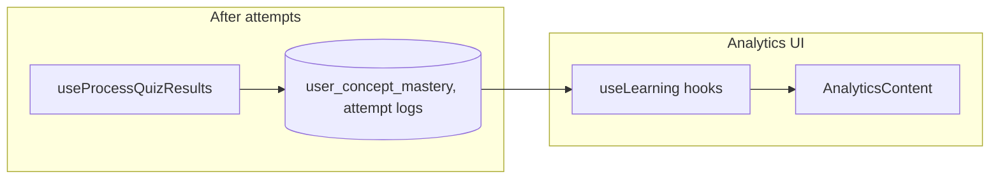

# Architecture: Analytics

The **Analytics** workspace is a **read-mostly** presentation layer over the same **learning intelligence** data that powers the learning path: **concept mastery** (WMS + confidence + **display decay**), **weak topics**, **score trends**, **study activity**, and **mastery over time**. Heavy computation stays in **`learningAlgorithms.ts`** and **`useLearning.ts`**; charts use **Recharts** in the UI.

## Overview

- **Route**: `/analytics` → `AnalyticsPage` → `AnalyticsContent`.
- **Primary hooks** (from `AnalyticsContent.tsx`): `useLearningStats`, `useConceptMasteryList`, `useWeakTopics`, `useScoreTrend`, `useStudyActivity`, `useMasteryTimeline`, plus `useUserAttempts` and `useQuizzes` where needed.
- **Visualization**: Bar, line, and pie charts; **ActivityHeatmap** component for study cadence.
- **Drill-down**: `ConceptDrillDown` shows per-concept mastery, confidence, SM-2 fields, and optional timeline — aligned with **`ConceptMasteryWithDetails`** (includes `display_mastery_score` / `display_mastery_level` from decay).

Analytics does **not** run the document NLP pipeline; it reflects **student performance** on materials already processed.

## Technologies

| Concept | Where it lives | Role in analytics |
|---------|----------------|-------------------|
| **WMS** | `learningAlgorithms.ts` | Raw mastery from attempts; blended with confidence |
| **Confidence** | `calculateConfidence` | Drives “how sure are we” metrics |
| **SM-2** | `calculateSM2`, `mapScoreToQuality` | Intervals, due dates — shown as scheduling context |
| **Display decay** | `calculateMasteryWithDecay`, `getMasteryLevelWithDecay` | **Visual** mastery when reviews are overdue |
| **Priority** | `calculatePriorityScore` | Used in planning more than charts, but same data model |
| **Charts** | **Recharts** (`BarChart`, `LineChart`, `PieChart`) | Trends and distributions |
| **Data fetch** | **TanStack Query** + **Supabase** client in `useLearning.ts` | Cached queries for stats and timelines |

## Data Flow



1. Quizzes and flashcards update **`user_concept_mastery`** and related logs via **`useProcessQuizResults`** (WMS + SM-2).
2. Analytics hooks **select** aggregated / joined views (concepts + documents + timelines).
3. UI computes presentation slices (percentages, weak lists, streaks) with `useMemo` where appropriate.

## Connection to the Rest of the System

| Feature | Link |
|---------|------|
| **Learning path** | Same `useConceptMasteryList`; UI links between path and `/analytics` |
| **Quiz generation** | Weak areas inform adaptive quizzes; analytics shows outcome |
| **AI Tutor** | Independent data path; both per-document insights can coexist |
| **Document scope** | `ConceptDrillDown` and routes like `/analytics/document/:id` (if used in your router) tie charts to a file |

## Key Files

- `src/pages/AnalyticsPage.tsx` — page shell and positioning copy
- `src/components/analytics/AnalyticsContent.tsx` — tabs, charts, drill-down
- `src/components/analytics/ActivityHeatmap.tsx` — activity visualization
- `src/hooks/useLearning.ts` — stats, weak topics, timelines, `useProcessQuizResults`
- `src/lib/learningAlgorithms.ts` — WMS, SM-2, decay (**reference formulas** for presentations)

## Code Snippets

**Analytics imports — which hooks feed the workspace:**

```32:38:d:\EduCoach\src\components\analytics\AnalyticsContent.tsx
import {
    useLearningStats, useConceptMasteryList, useWeakTopics,
    useScoreTrend, useStudyActivity, useMasteryTimeline,
} from "@/hooks/useLearning"
import type { ConceptMasteryWithDetails } from "@/hooks/useLearning"
import { useUserAttempts, useQuizzes } from "@/hooks/useQuizzes"
import { ActivityHeatmap } from "@/components/analytics/ActivityHeatmap"
```

**Mastery row shape includes display decay fields (hook types):**

```29:60:d:\EduCoach\src\hooks\useLearning.ts
export interface ConceptMasteryRow {
    id: string
    user_id: string
    concept_id: string
    document_id: string | null
    mastery_score: number
    confidence: number
    mastery_level: 'needs_review' | 'developing' | 'mastered'
    total_attempts: number
    correct_attempts: number
    last_attempt_at: string | null
    repetition: number
    interval_days: number
    ease_factor: number
    due_date: string
    last_reviewed_at: string | null
    priority_score: number
    created_at: string
    updated_at: string
}

export interface ConceptMasteryWithDetails extends ConceptMasteryRow {
    concept_name: string
    concept_category: string | null
    concept_difficulty: string | null
    document_title: string | null
    document_exam_date: string | null
    /** Mastery after time-based decay (display only, raw value unchanged) */
    display_mastery_score: number
    /** Mastery level after decay */
    display_mastery_level: 'needs_review' | 'developing' | 'mastered'
}
```

**Display-only decay (for explaining “why mastery dropped” in UI):**

```314:328:d:\EduCoach\src\lib\learningAlgorithms.ts
/**
 * Apply time-based decay to a mastery score when a concept is overdue.
 *
 * The idea: if you haven't reviewed something past its SM-2 due date,
 * your *displayed* mastery gradually decreases to encourage review.
 * The stored value stays the same — this is display-only.
 *
 * Formula:
 *   if not overdue → return mastery unchanged
 *   overdueFactor = min(1, daysOverdue / (intervalDays × 3))
 *   decayedMastery = mastery × (1 - maxDecay × overdueFactor)
 *
 * - Max 15% penalty even for severely overdue items
 * - Longer intervals (well-learned items) are more forgiving
 * - Items only 1-2 days late barely decay at all
 */
```

## Presentation Tips

- **WMS**: Emphasize recency-weighted last three attempts and difficulty/time weighting (`calculateAttemptScore`).
- **SM-2**: Show mapping from quiz score → quality 0–5 → next interval (`mapScoreToQuality`, `calculateSM2`).
- **Decay**: Clarify it is **motivational/display** — stored mastery updates only on new attempts.
- **Separation of concerns**: Analytics **observes**; the learning path **schedules**; quiz generation **targets** weak concepts.

## Related Docs

- `docs/architecture/architecture-learning-path.md` — same mastery source, different UX
- `docs/info/dependency-maps/phase-5-learning-intelligence-analytics-dependency-map.md` — web wiring map
