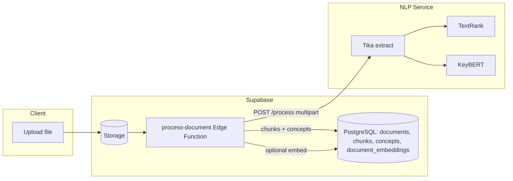

# Architecture: File & Content Extraction

This document describes how EduCoach ingests study files, extracts text and structure, derives concepts and summaries, and prepares data for quizzes, RAG chat, and analytics.

## Overview

Uploads land in **Supabase Storage**. The **`process-document`** Supabase Edge Function orchestrates the pipeline: download the file, extract text (preferably via the **NLP microservice**), chunk content, derive concepts (default **Pure NLP** or optional **Gemini**), persist rows in PostgreSQL, and optionally create **vector embeddings** for semantic search (AI Tutor).

## Technologies

| Layer | Technology | Role |
|--------|------------|------|
| Orchestration | Supabase Edge Function (`process-document`) | Auth/env, storage download, chunking, DB writes, optional Gemini |
| Text extraction | **Apache Tika** (via NLP service) | PDF, DOCX, PPTX, etc. → text / XHTML for slide-aware parsing |
| NLP stack | **spaCy** (`en_core_web_sm`) | Sentence segmentation, linguistic pipeline |
| Sentence ranking | **pytextrank** (TextRank graph on spaCy doc) | Top important sentences for summaries and concept seeds |
| Keyphrases | **KeyBERT** + **sentence-transformers** (`all-MiniLM-L6-v2`) | Salient phrases; shared embedding model with KeyBERT to save memory |
| Clustering (concepts) | **scikit-learn** `AgglomerativeClustering`, cosine distance | Group related sentences into concept-like clusters (service-side) |
| HTML structure | **BeautifulSoup** | Slide/page boundaries from Tika XHTML (`slide-content`, `page` divs) |
| Encoding repair | **ftfy** | Fix mojibake / bad encodings |
| Optional AI | **Google Gemini** | Richer summaries/concepts when `processor: 'gemini'` or refinement |
| Embeddings | **Gemini** `gemini-embedding-001` (768 dimensions) | Stored in `document_embeddings` for `match_documents_for_user` |

## End-to-End Flow



1. **Trigger**: Client invokes `process-document` with `documentId` (and optional `processor`: `pure_nlp` | `gemini`).
2. **Download**: Edge function loads the blob from Storage using the service role.
3. **Extract**: Calls `${NLP_SERVICE_URL}/process` with the file; receives full text, keywords, important sentences, optional slide metadata, clusters, etc.
4. **Chunk**: Edge function splits text into overlapping chunks (defaults include ~2800 characters, 200 overlap, cap on chunk count) for RAG-sized segments.
5. **Concepts**: Either maps Pure NLP output to `Concept[]` or calls Gemini for structured concepts + summary.
6. **Persist**: Inserts/updates `chunks`, `concepts`, clears stale embeddings; maps concepts to best-matching chunks.
7. **Embeddings** (if `GEMINI_API_KEY` set): Batches calls to Gemini embedding API and inserts into `document_embeddings`.

## How Pure NLP Is Used

- **TextRank** surfaces the most central sentences (good for summaries and grounding).
- **KeyBERT** pulls keyphrases used for concept naming, clustering hints, and downstream quiz anchoring.
- The Edge Function treats this as the **default** path (`DEFAULT_PROCESSOR` / `USE_PURE_NLP` env); Gemini refines or replaces when explicitly requested and configured.

## Connection to the Rest of the System

| Consumer | Uses extraction output |
|----------|-------------------------|
| **Quiz generation** | `chunks`, `concepts`, keyphrases; `generate-quiz` builds NLP payloads from DB rows |
| **AI Tutor** | `document_embeddings` + `chunks` via `match_documents_for_user` |
| **Learning path / analytics** | `user_concept_mastery` ties to `concepts`; documents supply titles, deadlines, goals |
| **File detail UI** | Reads processed `documents.status`, summaries, concepts from Supabase |

## Key Code Locations

- Edge orchestration: `supabase/functions/process-document/index.ts`
- NLP service: `nlp-service/main.py` (`/process`, spaCy + TextRank + KeyBERT setup near top of file)
- Embeddings helper in edge function: `generateEmbeddingsForChunks` / `generateEmbedding` (Gemini `gemini-embedding-001`, 768-dim)

## Code Snippets

**NLP service stack initialization (spaCy + TextRank + KeyBERT):**

```62:68:d:\EduCoach\nlp-service\main.py
# Load spaCy model with TextRank
nlp = spacy.load("en_core_web_sm")
nlp.add_pipe("textrank")

# Load sentence-transformer model (shared with KeyBERT to save memory)
st_model = SentenceTransformer("sentence-transformers/all-MiniLM-L6-v2")
kw_model = KeyBERT(model=st_model)
```

**Edge function: call NLP `/process` for extraction:**

```720:768:d:\EduCoach\supabase\functions\process-document\index.ts
async function extractWithNlpService(
    blob: Blob,
    nlpServiceUrl: string,
    fileType: string
): Promise<NlpExtractionResult> {
    console.log(`🔧 Calling NLP service at ${nlpServiceUrl}...`)

    try {
        // Create form data with the file
        const formData = new FormData()
        formData.append('file', blob, `document.${fileType}`)

        const timeoutMs = parseTimeoutMs(Deno.env.get('NLP_SERVICE_TIMEOUT_MS'), 60000)
        const response = await fetchWithTimeout(
            `${nlpServiceUrl}/process`,
            {
                method: 'POST',
                body: formData,
            },
            timeoutMs
        )
        // ... parses keywords, important_sentences, slides, etc.
```

**Chunking parameters (RAG-oriented):**

```27:30:d:\EduCoach\supabase\functions\process-document\index.ts
const CHUNK_SIZE = 2800       // Characters per chunk (~700 tokens) - optimized for RAG retrieval
const CHUNK_OVERLAP = 200     // Overlap between chunks for context continuity
const MAX_CHUNKS = 20         // Maximum chunks to process
```

## Related Docs

- `docs/workflow-guide/WORKFLOW_PURE_NLP.md` — operational default (Pure NLP first, Gemini optional)
- `docs/architecture/architecture-quiz-generation.md` — consumes chunks/concepts
- `docs/architecture/architecture-ai-chat.md` — consumes embeddings + chunks
