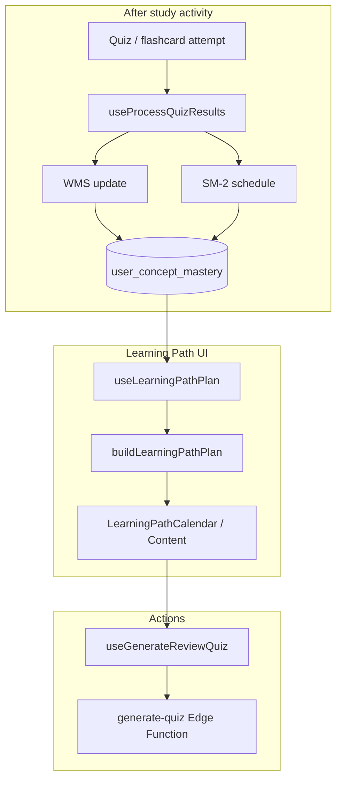

# Architecture: Learning Path

The **Learning Path** is the study orchestration surface: it merges **spaced-repetition due dates**, **priority scoring**, **adaptive study tasks** (quizzes / flashcards / review), **quiz deadlines**, and **study goals** into a calendar and list UI. The math for mastery and scheduling lives in **`learningAlgorithms.ts`** (WMS, SM-2, priority, decay); the **plan** is assembled client-side in **`learningPathPlan.ts`** and exposed via **`useLearningPathPlan`**.

## Overview

- **Data sources** (React Query): `useConceptMasteryList`, `useAdaptiveStudyTasks`, `useDocuments`, `useQuizzes`, plus profile fields (`daily_study_minutes`, preferred study times, available days).
- **Plan builder**: `buildLearningPathPlan` outputs sorted **items**: planned reviews (baseline vs performance), adaptive tasks, goal markers (file goals / quiz deadlines).
- **UI**: `LearningPathPage`, `LearningPathCalendar`, `LearningPathContent` — scoped routes support `?scope=document|study_goal&id=...` via `learningPathScope`.
- **Adaptive quiz generation**: When a task is `needs_generation` and due, the client can call **`useGenerateReviewQuiz`** with `focusConceptIds` (see `LearningPathPage` effect and `LearningPathContent` handlers).

## Technologies (Conceptual)

| Concept | Implementation | Role |
|---------|----------------|------|
| **WMS** | `calculateTopicMastery`, `calculateFinalMastery`, `getMasteryLevel` in `learningAlgorithms.ts` | Score from recent attempts + confidence blend |
| **SM-2** | `mapScoreToQuality`, `calculateSM2` | Next review interval, ease factor, due date after quiz performance |
| **Priority score** | `calculatePriorityScore` | Weakness + deadline pressure + low-practice penalty → ordering |
| **Display decay** | `calculateMasteryWithDecay`, `getMasteryLevelWithDecay` | Visual “forgetting” when overdue (display-only) |
| **Plan composition** | `buildLearningPathPlan` in `learningPathPlan.ts` | Merges mastery rows, tasks, documents, quizzes |
| **Adaptive tasks** | `adaptive_study_tasks` (via `useAdaptiveStudy`) | Scheduled quiz/flashcard/review units with `conceptIds` |

SM-2 and WMS are applied when results are processed (`useProcessQuizResults` in `useLearning.ts`), updating `user_concept_mastery`; the learning path **reads** those rows.

## Flow (High Level)



1. Student completes quizzes; client runs **WMS + SM-2** and writes mastery.
2. **`useLearningPathPlan`** pulls mastery + adaptive tasks + documents + quizzes.
3. **`buildLearningPathPlan`** assigns dates/times (respecting daily minutes and preferred windows where configured).
4. UI shows **due today**, **upcoming**, **adaptive** rows; user or auto-effect triggers **review quiz generation** with focused concepts.

## Connection to the Rest of the System

| System | Relationship |
|--------|----------------|
| **Quiz generation** | Review quizzes use `focusConceptIds`; edge function loads mastery for adaptive difficulty |
| **Analytics** | Same `user_concept_mastery` and attempts; links from path UI to `/analytics/document/:id` |
| **AI Tutor** | Independent; both consume documents/concepts |
| **Profiling** | `daily_study_minutes`, study windows, available days feed time assignment in the plan |

## Key Files

- `src/lib/learningPathPlan.ts` — plan data structures and `buildLearningPathPlan`
- `src/hooks/useLearningPathPlan.ts` — wires queries + profile into builder + scope filter
- `src/lib/learningPathScope.ts` — scope resolution for document / study goal routes
- `src/lib/learningAlgorithms.ts` — WMS, SM-2, priority, decay (**pure functions**)
- `src/hooks/useLearning.ts` — `useProcessQuizResults`, mastery queries
- `src/hooks/useAdaptiveStudy.ts` — adaptive task CRUD / keys
- `src/pages/LearningPathPage.tsx` — schedule aggregation, auto adaptive generation effect
- `src/components/learning-path/LearningPathCalendar.tsx` — calendar view + task actions

## Code Snippets

**WMS pipeline comment and SM-2 core (same module):**

```1:8:d:\EduCoach\src\lib\learningAlgorithms.ts
/**
 * Learning Algorithms — Pure Functions
 *
 * Contains WMS (Weighted Mastery Score), SM-2 (Spaced Repetition),
 * and Global Scheduler (Priority Score) calculations.
 *
 * Zero side effects, zero DB calls — just math.
 */
```

```245:272:d:\EduCoach\src\lib\learningAlgorithms.ts
export function calculateSM2(input: SM2Input): SM2Result {
    const q = Math.max(0, Math.min(5, input.quality))
    let rep = input.repetition
    let interval = input.interval
    let ef = input.easeFactor

    if (q >= 3) {
        if (rep === 0) {
            interval = 1
        } else if (rep === 1) {
            interval = 6
        } else {
            interval = Math.round(interval * ef)
        }
        rep += 1
    } else {
        rep = 0
        interval = 1
    }

    ef = ef + (0.1 - (5 - q) * (0.08 + (5 - q) * 0.02))
    ef = Math.max(1.3, Math.round(ef * 100) / 100)

    const due = new Date()
    due.setUTCDate(due.getUTCDate() + interval)
    const dueDate = due.toISOString().split('T')[0]

    return { repetition: rep, interval, easeFactor: ef, dueDate }
}
```

**Hook composing the plan:**

```11:31:d:\EduCoach\src\hooks\useLearningPathPlan.ts
export function useLearningPathPlan(scopeFilter?: LearningPathPlanScopeFilter) {
    const { profile } = useAuth()
    const masteryQuery = useConceptMasteryList()
    const adaptiveTasksQuery = useAdaptiveStudyTasks()
    const documentsQuery = useDocuments()
    const quizzesQuery = useQuizzes()

    const plan = useMemo(
        () => {
            const fullPlan = buildLearningPathPlan({
                masteryRows: masteryQuery.data || [],
                adaptiveTasks: adaptiveTasksQuery.data || [],
                documents: documentsQuery.data || [],
                quizzes: quizzesQuery.data || [],
                dailyStudyMinutes: profile?.daily_study_minutes ?? 30,
                preferredStudyTimeStart: profile?.preferred_study_time_start ?? null,
                preferredStudyTimeEnd: profile?.preferred_study_time_end ?? null,
                availableStudyDays: profile?.available_study_days ?? null,
            })

            return filterLearningPathPlan(fullPlan, scopeFilter)
        },
        // ...deps
    )
```

**Auto-generation of adaptive review quiz when a task is due:**

```307:331:d:\EduCoach\src\pages\LearningPathPage.tsx
        const nextQuizTask = adaptiveTasks
            .filter((task) => task.type === "quiz" && task.status === "needs_generation" && !!task.scheduledDate)
            .filter((task) => task.taskKey?.startsWith('manual:') || !hasReusableReadyQuizForDocument(task.documentId))
            .sort((a, b) => a.scheduledDate.localeCompare(b.scheduledDate))
            .find((task) =>
                task.scheduledDate! <= todayLocal &&
                !completedAdaptiveDocumentIdsToday.has(task.documentId),
            )

        if (!nextQuizTask) return
        // ...
        generateReview.mutate(
            {
                documentId: nextQuizTask.documentId,
                focusConceptIds: nextQuizTask.conceptIds,
                questionCount: Math.max(10, Math.min(20, nextQuizTask.conceptIds.length * 2)),
                forceNew: nextQuizTask.taskKey?.startsWith('manual:') === true,
                sourceTaskId: nextQuizTask.id,
            },
```

## Related Docs

- `docs/info/learning_path_explained.md` — narrative explanation
- `docs/architecture/architecture-analytics.md` — visualization of same mastery data
- `docs/architecture/architecture-quiz-generation.md` — downstream of path actions
