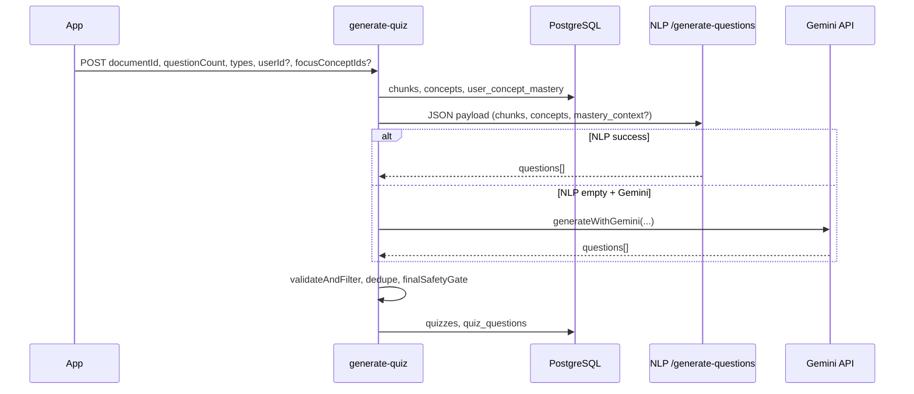

# Architecture: Quiz Generation

This document describes how EduCoach builds quizzes from processed documents: template-driven **Automatic Question Generation (AQG)** in the NLP service, optional **Gemini** fallback, **mastery-aware** weighting from `user_concept_mastery`, and persistence to PostgreSQL.

## Overview

The **`generate-quiz`** Supabase Edge Function:

1. Loads **chunks** and **concepts** for the document from the database.
2. Optionally loads **`user_concept_mastery`** for the requesting user (adaptive difficulty and per-chunk quotas).
3. Builds a JSON payload for **`POST /generate-questions`** on the NLP service (primary path).
4. If the NLP service returns no questions and Gemini is configured, falls back to **Gemini-only** generation.
5. Runs deterministic **validation / deduplication** (question types, identification shape, severe failure reasons, etc.).
6. Inserts **quiz** + **questions** rows and updates status.

Question types supported in pipeline include: `multiple_choice`, `identification`, `true_false`, `fill_in_blank` (see edge function `VALID_QUESTION_TYPES`).

## Technologies

| Component | Technology | Role |
|-----------|------------|------|
| Orchestration | `generate-quiz` Edge Function | DB reads/writes, payload build, fallbacks, safety gates |
| Primary AQG | NLP service **`/generate-questions`** | Template questions from chunk sentences + keyphrases |
| NLP core | **spaCy** | Sentence splitting, linguistic checks (`is_good_sentence`, declarative tests for T/F) |
| Keyphrases in AQG | **KeyBERT** (on chunk text when chunk keyphrases empty) | Extra keyphrases for MCQ / fill-in / identification |
| Mastery (adaptive) | **`user_concept_mastery`** + WMS-derived levels in DB | Per-concept `adaptive_difficulty`; weak chunks get higher `max_questions` |
| Allocation | `quizAllocation.ts` | `computeBalancedQuizTypeTargets` for per-type counts |
| Identification QA | `identificationContract.ts` | Filter invalid identification items |
| Fallback | **Google Gemini** | Full quiz generation when NLP returns zero questions |
| Optional NLP-internal QA | (stats in response: `geminiQaReviewed`, etc.) | Per NLP service configuration — edge function tracks metrics |

**WMS (Weighted Mastery Score)** is computed in the app when quiz attempts are processed (`useLearning` / `learningAlgorithms.ts`); quiz generation **reads** the stored mastery snapshot from `user_concept_mastery`, it does not recompute WMS inside the edge function.

## End-to-End Flow



## Mastery-Aware Behavior (Phase 6.1)

When mastery rows exist:

- **`adaptive_difficulty`**: `< 60` → `beginner`, `60–79` → `intermediate`, `≥ 80` → `advanced`.
- **`mastery_context`** is sent to the NLP service so templates can bias difficulty per concept mention in a sentence.
- **Per-chunk `max_questions`**: ~2× when the chunk has weak concepts; ~0.5× when all referenced concepts are strong (`≥ 80`).

## Connection to the Rest of the System

| Area | Link |
|------|------|
| **Content extraction** | Requires processed `chunks` + `concepts` from `process-document` |
| **Learning path** | `useGenerateReviewQuiz` / adaptive tasks pass `focusConceptIds`; titles reflect weak vs review |
| **Analytics** | Attempts update mastery via `useProcessQuizResults` → feeds the next generation |
| **Mobile / web** | Same Edge Function; priority tier (free vs premium) affects queueing |

## Key Files

- `supabase/functions/generate-quiz/index.ts` — main orchestration
- `supabase/functions/generate-quiz/quizAllocation.ts` — type targets
- `supabase/functions/generate-quiz/identificationContract.ts` — identification filtering
- `nlp-service/main.py` — `@app.post("/generate-questions")`

## Code Snippets

**Edge function: mastery load and adaptive difficulty:**

```408:438:d:\EduCoach\supabase\functions\generate-quiz\index.ts
        if (resolvedUserId && activeConceptList.length > 0) {
            try {
                const conceptIds = activeConceptList.map(c => c.id)
                const { data: masteryRows } = await supabase
                    .from('user_concept_mastery')
                    .select('concept_id, mastery_score, mastery_level')
                    .eq('user_id', resolvedUserId)
                    .in('concept_id', conceptIds)
                // ... fills masteryMap
            } catch (err) {
                console.warn('⚠️ Could not load mastery data, proceeding without:', (err as Error).message)
            }
        }

        function getAdaptiveDifficulty(conceptId: string): string {
            const m = masteryMap.get(conceptId)
            if (!m) return difficulty === 'mixed' ? 'mixed' : (DIFFICULTY_MAP[difficulty] || 'intermediate')
            if (m.mastery_score < 60) return 'beginner'     // weak → easier Qs
            if (m.mastery_score < 80) return 'intermediate'  // developing → medium
            return 'advanced'                                // strong → harder Qs
        }
```

**NLP service: `/generate-questions` docstring and KeyBERT fallback inside AQG:**

```2891:2983:d:\EduCoach\nlp-service\main.py
@app.post("/generate-questions", response_model=GenerateQuestionsResponse)
def generate_questions(input: GenerateQuestionsInput):
    """
    Template-driven Automatic Question Generation (AQG).
    Generates grounded questions from chunk text using spaCy NLP.
    Supports difficulty targeting and concept coverage balancing.
    """
    # ...
            keyphrases = filter_keywords(chunk.keyphrases) if chunk.keyphrases else []
            if not keyphrases:
                try:
                    kw_text = text[:KEYBERT_INPUT_MAX_CHARS]
                    raw = kw_model.extract_keywords(
                        kw_text,
                        keyphrase_ngram_range=(1, 3),
                        stop_words="english",
                        top_n=8,
                        use_maxsum=True,
                        nr_candidates=20,
                    )
                    keyphrases = filter_keywords([k[0] for k in raw])
                except Exception:
                    keyphrases = []
```

**Payload to NLP including `mastery_context`:**

```551:586:d:\EduCoach\supabase\functions\generate-quiz\index.ts
                const nlpPayload: NlpGenerateQuestionsPayload = {
                    chunks: nlpChunks,
                    all_keyphrases: allKeyphrases,
                    question_types: questionTypes,
                    question_type_targets: requestedTargetsByType as Record<string, number>,
                    max_questions_per_chunk: Math.min(5, Math.ceil(questionCount / Math.max(1, chunks.length)) + 1),
                    max_total_questions: questionCount,
                    difficulty: nlpDifficulty,
                    concepts: conceptInfo,
                }

                if (masteryMap.size > 0) {
                    nlpPayload.mastery_context = activeConceptList.map(c => ({
                        concept_name: c.name,
                        mastery_level: masteryMap.get(c.id)?.mastery_level ?? 'unknown',
                        mastery_score: masteryMap.get(c.id)?.mastery_score ?? null,
                        adaptive_difficulty: getAdaptiveDifficulty(c.id),
                    }))
                    // ... per-chunk max_questions adjustments for weak/mastered
                }
```

## Related Docs

- `.cursor/skills/quiz-question-type-allocation/SKILL.md` — deterministic type allocation rules (if you need UX/backend parity details)
- `docs/architecture/architecture-content-extraction.md` — upstream chunks/concepts
- `docs/architecture/architecture-learning-path.md` — review quiz triggers
