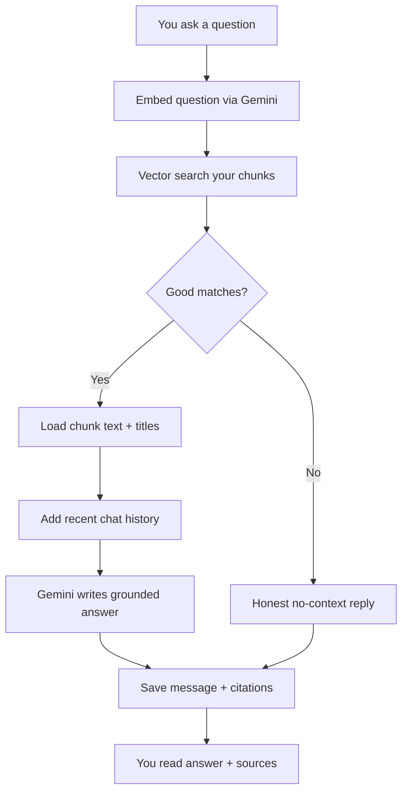

# AI Chat (AI Tutor) — Beginner’s Guide

This guide explains **how the AI Tutor answers using your own materials** (RAG: retrieval-augmented generation), without jargon-first.

For a shorter, code-heavy reference, see [architecture-ai-chat.md](./architecture-ai-chat.md).

---

## Who this is for

Anyone asking: *“Is the chat just ChatGPT? Why does it sometimes say it can’t find an answer?”*

---

## The big idea in one sentence

The tutor **searches your uploaded, processed notes** for passages similar to your question, puts those passages in front of **Gemini**, and asks Gemini to answer **only from that evidence**—so answers stay tied to **your** files.

---

## Why not “plain ChatGPT”?

A general model can **hallucinate** or use **generic** explanations. EduCoach’s design goal for the tutor is:

- **Grounding:** Prefer text you actually uploaded.
- **Privacy boundaries:** Search only **your** documents (enforced in the database).
- **Traceability:** Store which chunks were used so you can see **sources**.

---

## Key terms (simple)

| Term | Meaning |
|------|--------|
| **RAG** | Retrieve relevant snippets, then **generate** an answer using them. |
| **Embedding** | A numeric fingerprint of text; similar meanings → similar fingerprints. |
| **Vector search** | Compare your question’s fingerprint to chunk fingerprints to find the best matches. |
| **pgvector** | PostgreSQL extension storing those fingerprints efficiently. |
| **`match_documents_for_user`** | A database function that searches embeddings **only for your user id**. |
| **Chunk** | A passage from your document; retrieval returns chunk ids, then full text is loaded. |
| **Threshold** | Minimum similarity to count as a match; if nothing passes, the tutor admits “not in your materials.” |
| **Conversation history** | A few recent messages help Gemini stay coherent across follow-ups. |
| **Plain-text answer** | The system prompt asks for no markdown so the UI stays simple and consistent. |

---

## Prerequisites (easy to miss)

1. **Documents must be processed** (`process-document` completed).
2. **Embeddings must exist** for chunks (requires embedding configuration at processing time). Without embeddings, similarity search has nothing to compare.

---

## The workflow (step by step)

### Phase 1 — You send a message

1. You type a question in the AI Tutor UI (web or mobile).
2. The client calls the **`ai-tutor`** edge function with:
   - your **message**,
   - optional **conversation id** (continue a thread),
   - optional **document id** (restrict to one file).

### Phase 2 — Identity and limits

3. The function verifies **who you are** from your auth token.
4. It checks **subscription rules**: premium users get unlimited tutor messages; free users hit a **daily limit** (with friendly notifications as you approach it).

### Phase 3 — Turn the question into numbers

5. Your question text is sent to **Gemini’s embedding model** (`gemini-embedding-001`).
6. You get back a **768-dimensional vector** (a fixed-size list of numbers).

### Phase 4 — Find similar passages in *your* library

7. The function calls **`match_documents_for_user`** in Postgres with:
   - your embedding,
   - your **user id** (security),
   - similarity threshold and max number of hits,
   - optional **filter** to one document.

8. The database returns chunk ids and similarity scores.

### Phase 5 — If nothing matches

9. If no chunk is similar enough, the tutor answers honestly: it could not find relevant material (wording differs for “all documents” vs “this file only”).
10. It may still save the conversation for continuity.

### Phase 6 — Build context for the model

11. The function loads **full chunk text** and **document titles** from the database.
12. It builds labeled blocks like “Source: [title], Section N … passage …”.
13. It loads a short **history** of prior messages in this conversation.

### Phase 7 — Generate the reply

14. A **system prompt** tells Gemini the rules: use only the provided materials, plain text, cite sources, admit when missing.
15. **Gemini** (`gemini-2.5-flash-lite`) returns the answer.

### Phase 8 — Save and return

16. The assistant message, chunk ids, scores, and **citations** are saved.
17. The app shows the answer and **sources** so you can verify.

---

## Visual overview

---

## Common beginner misconceptions

1. **“It read my whole PDF in one go.”**  
   No—it pulls a **small set of relevant chunks** per question.

2. **“It knows my grade.”**  
   Mastery analytics live in a different part of the app; the tutor prompt is about **your materials**, not your quiz scores (unless you tell it).

3. **“Search is magic keyword match.”**  
   It is **semantic** similarity via embeddings, so paraphrases can still match—when embeddings exist and the idea is actually in your notes.

---

## How this connects to the rest of EduCoach

| Feature | Link |
|---------|------|
| Content extraction | Produces chunks and (when enabled) embeddings |
| Quizzes | Separate pipeline; both use the same underlying document content |
| Learning path | Suggests what to study; tutor helps explain that content |

---

## Where the code lives

- `supabase/functions/ai-tutor/index.ts`
- Database: `supabase/migrations/016_ai_tutor_remediation.sql` (`match_documents_for_user`, citations)

---

## Related reading

- [beginners-guide-content-extraction.md](./beginners-guide-content-extraction.md)
- [architecture-ai-chat.md](./architecture-ai-chat.md)
