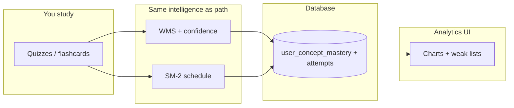

# Analytics — Beginner’s Guide

This guide explains **what the Analytics workspace shows** and **where those numbers come from**. Analytics is mostly **reading and visualizing** your learning data—not re-processing your PDFs.

For a shorter, code-heavy reference, see [architecture-analytics.md](./architecture-analytics.md).

---

## Who this is for

Anyone asking: *“What do mastery %, weak topics, and trends actually mean, and why did my score ‘drop’ without a new quiz?”*

---

## The big idea in one sentence

Analytics turns your **quiz and flashcard history** into **charts and lists** using the same **mastery engine** (WMS, confidence, SM-2, optional display decay) that powers the learning path—so you see **how you are doing**, not a separate mystery score.

---

## Why it exists

Students need feedback loops:

- **Am I improving?**
- **Which documents or concepts hurt me most?**
- **Am I studying often enough?**

Analytics answers those with **graphs** instead of raw database rows.

---

## Key terms (simple)

| Term | Meaning |
|------|--------|
| **Mastery score** | A numeric picture of how well you have answered on a concept recently (WMS-style). |
| **Confidence** | Whether we have enough attempts to trust the score. |
| **Display mastery** | What the UI shows after **optional decay** if you are overdue for review. |
| **Weak topics** | Concepts flagged as needing attention (low mastery or similar rules). |
| **Score trend** | How your quiz scores move over time (aggregated view). |
| **Study activity / heatmap** | When you were active, not just how high you scored. |
| **Mastery timeline** | How a concept’s mastery moved across dates (when available). |
| **Recharts** | The charting library drawing bars/lines/pies in the UI. |
| **React Query** | Fetches data from Supabase and caches it for snappy tabs. |

---

## What analytics does **not** do

- It does **not** run TextRank, KeyBERT, or Tika.
- It does **not** generate new questions.
- It does **not** replace the AI tutor.

It **reflects behavior** after you study.

---

## The workflow (step by step)

### Phase A — You produce data

1. You take quizzes or review flashcards.
2. Each attempt logs **which concepts** were touched and **whether you were correct**, plus timing metadata when captured.

### Phase B — The app updates mastery

3. When results are submitted, **`useProcessQuizResults`** runs the **WMS** pipeline:
   - recent attempts matter most,
   - harder questions count more when answered correctly,
   - very fast/slow answers can nudge the attempt score slightly.

4. **Confidence** grows as you accumulate attempts (you cannot “master” everything on one try).

5. **SM-2** updates **next due date** and interval from your performance band (mapped to a 0–5 “quality”).

6. These values are saved to **`user_concept_mastery`** (and related attempt logs).

### Phase C — You open Analytics

7. The **Analytics** page loads tabs/sections powered by hooks like:
   - **`useLearningStats`** (high-level counts),
   - **`useConceptMasteryList`** (rows per concept),
   - **`useWeakTopics`**,
   - **`useScoreTrend`**,
   - **`useStudyActivity`**,
   - **`useMasteryTimeline`**.

8. Components turn those arrays into **charts** (Recharts) and cards.

### Phase D — You drill into one concept (optional)

9. **Concept drill-down** shows mastery, confidence, scheduling fields, and sometimes a **mini timeline**.
10. If **display decay** applies, the percentage may look lower than the “stored” mastery—see below.

---

## Visual overview

---

## Display decay (why the chart moved without a new attempt)

If a concept’s **review date** has passed and you have not restudied, EduCoach can **lower the displayed mastery** a little to reflect “memory fades.”

- **Important:** this is mainly a **visual nudge**; your stored mastery updates when you **actually practice** again.
- Think of it as the app saying: *“You knew this, but it may be rusty now.”*

---

## How analytics helps you act

| Insight | Typical action |
|---------|----------------|
| Weak topics | Open the document, run a **review quiz**, or use the **learning path** |
| Low activity | Schedule consistent short sessions |
| Score trend down | Check if material got harder or if decay/overdue piled up |

---

## How this connects to the rest of EduCoach

| Area | Link |
|------|------|
| Learning path | Same mastery rows; path **schedules**, analytics **explains** |
| Quiz generation | Adaptive quizzes use mastery you see here |
| AI tutor | Explains content; does not replace performance tracking |

---

## Where the code lives

- Page: `src/pages/AnalyticsPage.tsx`
- Main UI: `src/components/analytics/AnalyticsContent.tsx`
- Heatmap: `src/components/analytics/ActivityHeatmap.tsx`
- Data + processing: `src/hooks/useLearning.ts`
- Formulas: `src/lib/learningAlgorithms.ts`

---

## Related reading

- [beginners-guide-learning-path.md](./beginners-guide-learning-path.md)
- [beginners-guide-quiz-generation.md](./beginners-guide-quiz-generation.md)
- [architecture-analytics.md](./architecture-analytics.md)
