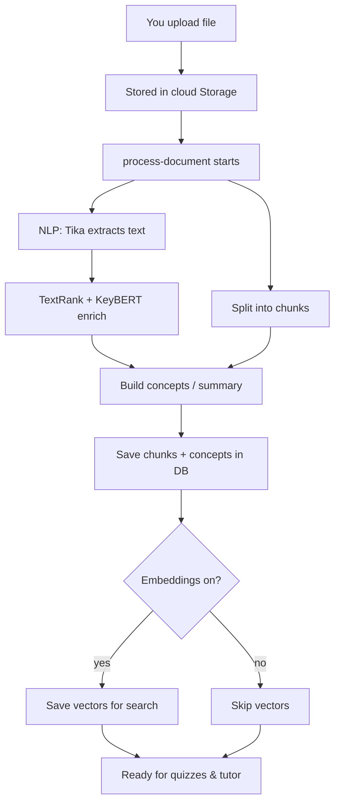

# File & Content Extraction — Beginner’s Guide

This guide explains **what happens after you upload a study file** in EduCoach, in plain language. You do not need to know every library name to understand the flow.

For a shorter, code-heavy reference, see [architecture-content-extraction.md](./architecture-content-extraction.md).

---

## Who this is for

Anyone new to EduCoach who wants to answer: *“I uploaded my notes—what does the system actually do with them?”*

---

## The big idea in one sentence

EduCoach turns your file into **searchable text**, **bite-sized passages (chunks)**, **concepts** (topics the app thinks matter), optional **summaries**, and optional **numeric fingerprints (embeddings)** so quizzes and the AI tutor can use your material later.

---

## Why this step matters

Everything downstream depends on good extraction:

- **Quizzes** need sentences and key ideas tied to your document.
- **AI chat** needs chunks and embeddings to find the right passages to answer questions.
- **Learning path & analytics** attach performance to **concepts** that came from this step.

If extraction fails (e.g. scanned PDF with no real text), later features have little to work with.

---

## Key terms (simple)

| Term | Meaning |
|------|--------|
| **Storage** | Where the original file bytes live (like a cloud folder). |
| **Edge function** | A small server program in the cloud that runs the “processing” job (`process-document`). |
| **NLP service** | A separate app that does heavy text work: pull text from PDFs, rank sentences, find keywords. |
| **Tika** | A tool that opens many file types and extracts readable text (and structure for slides). |
| **spaCy** | Software that understands language in a rule-based/neural way—splitting into sentences, etc. |
| **TextRank** | A way to score sentences: “which sentences are most central to the document?” |
| **KeyBERT** | A way to pull out **keyphrases** (important multi-word terms). |
| **Chunk** | A medium-length slice of text (with a little overlap) so the app can store and retrieve manageable pieces. |
| **Concept** | A structured “topic” with a name, description, importance, etc., often derived from ranked sentences and keywords. |
| **Pure NLP (default)** | Use Tika + TextRank + KeyBERT-style logic without asking a big LLM to invent the whole outline. |
| **Gemini (optional)** | Google’s model can produce richer summaries/concepts when you choose refinement or `processor: "gemini"`. |
| **Embedding** | A list of numbers representing “meaning” of a chunk; similar questions get similar numbers. Used for AI search. |

---

## The workflow (step by step)

### Phase A — You upload

1. You pick a file (PDF, Word, slides, etc.) in the app.
2. The app saves it to **Supabase Storage** and creates a **document** row in the database (title, owner, status like “processing”).

### Phase B — Processing starts

3. The app calls the **`process-document`** edge function with your **document id** (and optionally which processor: pure NLP vs Gemini).
4. The function **downloads** the file from Storage.

### Phase C — Text extraction (NLP service)

5. The file is sent to the **NLP service** at the `/process` endpoint (like mailing the file to a specialist).
6. **Apache Tika** reads the file and produces plain text (and for slides, structured HTML so the app knows slide/page boundaries).
7. **spaCy** splits text into sentences for analysis.
8. **TextRank** picks the most important sentences (good for summaries and seeds for concepts).
9. **KeyBERT** suggests strong keyphrases (good labels and anchors for later quizzes).

### Phase D — Chunking (back in the edge function)

10. The long text is split into **chunks**: each chunk is roughly a few thousand characters, with a small **overlap** so ideas are not cut awkwardly at the boundary.
11. There is a **maximum number of chunks** so very large files stay manageable.

### Phase E — Concepts and summaries

12. **Default path (Pure NLP):** ranked sentences and keywords are mapped into **concept** records the database understands.
13. **Optional Gemini path:** Gemini can generate a richer structured summary/concept set when requested and configured.

### Phase F — Saving to the database

14. Old derived data for that document may be cleared (so you do not mix stale chunks with new ones).
15. New **chunks** and **concepts** are saved and linked (concepts are matched to the best chunk when possible).

### Phase G — Embeddings (optional but important for chat)

16. If an API key is set, each chunk’s text is sent to **Gemini’s embedding model** to get a **768-number vector**.
17. Those vectors go into **`document_embeddings`** so the AI tutor can later search “passages similar to this question.”

### Phase H — You see results

18. The document status becomes “ready” (or “error” with a message).
19. The file detail screen shows summary, concepts, and links to quizzes and chat.

---

## Visual overview

---

## Two processing modes (mental model)

1. **Pure NLP (usual):** fast, consistent, no creative “invention” from a giant language model for the core structure. Good default for cost and predictability.
2. **Gemini:** use when you want **deeper** AI-generated summaries or concept sets, or when refining after Pure NLP.

---

## How this connects to the rest of EduCoach

| After extraction | Uses |
|------------------|------|
| Quiz generation | Chunks + concepts from the database |
| AI chat | Chunk text + embeddings (if generated) |
| Learning path / analytics | Concepts linked to mastery after you take quizzes |

---

## Where the code lives (for curious beginners)

- Orchestration: `supabase/functions/process-document/index.ts`
- NLP microservice: `nlp-service/main.py`

---

## Related reading

- [Document_Processing_Workflow_Pure_NLP.md](../workflow-guide/Document_Processing_Workflow_Pure_NLP.md)
- [architecture-content-extraction.md](./architecture-content-extraction.md)
