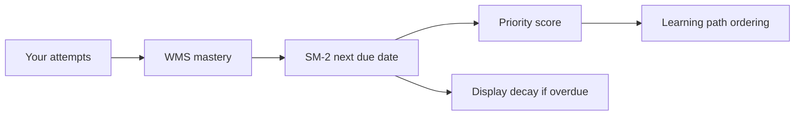

# Learning Path Calculations (WMS, SM-2, Priority) — Beginner Guide

This guide explains the **math behind EduCoach learning path scheduling** in a simple way.
It focuses on four pieces:

1. **WMS** (how mastery is scored),
2. **SM-2** (how next review date is scheduled),
3. **Priority score** (what should be studied first),
4. **Display decay** (why overdue topics can look slightly lower).

Source of truth in code: `src/lib/learningAlgorithms.ts`.

---

## Big picture

When you finish quizzes/flashcards, EduCoach updates each concept using this chain:

Think of it as:
- **WMS** answers: "How well do you currently know this?"
- **SM-2** answers: "When should you review this again?"
- **Priority** answers: "Among all topics, what is urgent today?"

---

## Basis used by each calculation

This section answers "what exact inputs does the system use?"

| Metric | Basis / Inputs used |
|--------|----------------------|
| **WMS attempt score** | `is_correct`, `question_difficulty`, `time_spent_seconds` |
| **Raw mastery** | Up to latest 3 attempts + recency weights `[1.0, 0.85, 0.70]` |
| **Confidence** | Number of evidence attempts (`attemptCount`) with `k=3` |
| **Final mastery** | `rawMastery`, `confidence`, baseline `50` |
| **Mastery level** | `finalMastery` thresholds + confidence requirement for mastered |
| **SM-2 quality** | Score percent mapped to 0..5 using configured/default bands |
| **SM-2 next due date** | Current `repetition`, `interval`, `easeFactor`, plus current quality |
| **Priority score** | `finalMastery`, `dueDate`, `confidence`, weight config (`0.65/0.25/0.10`) |
| **Display decay** | Stored `mastery`, `dueDate`, `intervalDays`, `maxDecay=0.15` |
| **Plotted day on learning path** | `due_date`, today, study-day availability, per-day capacity, document deadline, whether already reviewed today, adaptive task status |

---

## 1) WMS (Weighted Mastery Score)

WMS is built from your **most recent attempts** (up to last 3) for a concept.

### Step 1: Attempt score

For each attempt:

`AttemptScore = Correct × DifficultyWeight × TimeWeight`

- If incorrect, score is `0`.
- Difficulty weights:
  - beginner = `1.0`
  - intermediate = `1.1`
  - advanced = `1.2`
- Time weight (if known):
  - <=15s: `1.10`
  - <=30s: `1.05`
  - <=60s: `1.00`
  - <=120s: `0.95`
  - >120s: `0.85`
- Score is capped at `1.0`.

### Step 2: Raw mastery from recency-weighted attempts

Only the latest 3 attempts are used with weights:

- newest: `1.0`
- second newest: `0.85`
- third newest: `0.70`

Formula:

`RawMastery = 100 × Σ(AttemptScore_i × RecencyWeight_i) / Σ(RecencyWeight_i)`

### Step 3: Confidence

Confidence increases with evidence:

`Confidence = min(1, attemptCount / 3)`

So:
- 1 attempt -> `0.33`
- 2 attempts -> `0.67`
- 3+ attempts -> `1.0`

### Step 4: Final mastery (anti-lucky-guess blend)

`FinalMastery = Confidence × RawMastery + (1 - Confidence) × 50`

Why 50? It is a neutral baseline so one lucky correct answer does not instantly mean "mastered."

### Step 5: Mastery level

- **Mastered**: `finalMastery >= 80` **and** `confidence >= 0.80`
- **Developing**: `finalMastery >= 60`
- **Needs review**: below 60

### Quick worked example

Suppose latest 3 attempts for Concept X are:
- correct, advanced, 20s -> attempt score capped to `1.0`
- correct, intermediate, 75s -> `1.1 × 0.95 = 1.045`, capped to `1.0`
- incorrect -> `0`

Raw mastery:
- weighted sum = `1.0*1.0 + 1.0*0.85 + 0*0.70 = 1.85`
- weight sum = `1.0 + 0.85 + 0.70 = 2.55`
- raw = `100 × 1.85/2.55 = 72.55`

Confidence = `3/3 = 1.0`  
Final mastery = `1.0*72.55 + 0*50 = 72.55`  
Level = **Developing**

### Why this example result is valid (basis check)

- It used **exactly 3 most recent** attempts (older attempts are ignored for raw mastery).
- Difficulty/time rules were applied per attempt, then capped at `1.0`.
- Confidence reached `1.0` because there were already 3 evidence attempts.
- Since confidence was full, final mastery stayed equal to raw mastery (no pull toward baseline 50).

---

## 2) SM-2 scheduling (next review date)

After scoring, EduCoach computes **when** you should see the concept again.

### Step 1: Map quiz/attempt performance to quality (0-5)

Default mapping:
- >=90 -> `5`
- 80-89 -> `4`
- 65-79 -> `3`
- 50-64 -> `2`
- 30-49 -> `1`
- <30 -> `0`

### Step 2: Update repetition/interval/ease factor

Rules:
- If quality >= 3: scheduling advances
  - rep 0 -> interval 1 day
  - rep 1 -> interval 6 days
  - rep >=2 -> interval = round(previousInterval * easeFactor)
- If quality < 3: reset
  - repetition = 0
  - interval = 1 day

Ease factor update:

`EF' = EF + (0.1 - (5-q)(0.08 + (5-q)*0.02))`

with minimum EF of `1.3`.

Then:
- `dueDate = today + interval`

### Quick example

Current state: repetition=2, interval=6, EF=2.5  
New quality = 4

- New interval = `round(6 * 2.5) = 15`
- New repetition = 3
- New EF = `2.5 + (0.1 - (1*(0.08 + 0.02))) = 2.5`
- Due date = today + 15 days

### Why this due date is the basis for plotting

- The learning path uses this `dueDate` as the concept's planned review date.
- In plan building, each mastery row becomes a `planned_review` item with:
  - `date = mastery.due_date`
  - `priorityScore = mastery.priority_score`
- So if SM-2 says due in 15 days, that is the first candidate day for that planned review.

---

## 3) Priority score (what to study first)

Priority is a `0..1` urgency value. Higher means "schedule sooner."

Formula:

`Priority = w1*(1 - mastery/100) + w2*deadlinePressure + w3*lowPracticePenalty`

Default weights:
- weakness `w1 = 0.65`
- deadline `w2 = 0.25`
- practice `w3 = 0.10`

Where:
- `weakness = 1 - finalMastery/100`
- `deadlinePressure = clamp(1 - daysUntilDue/14, 0..1)`
- `lowPracticePenalty = 1 - confidence`

### Intuition

- Low mastery -> high urgency.
- Due date near/past -> higher urgency.
- Low confidence (not enough evidence) -> small urgency bump.

### Quick example

If:
- finalMastery = 55  -> weakness = 0.45
- due in 3 days      -> deadlinePressure = 1 - 3/14 = 0.7857
- confidence = 0.67  -> lowPracticePenalty = 0.33

Priority:
- `0.65*0.45 + 0.25*0.7857 + 0.10*0.33`
- `= 0.2925 + 0.1964 + 0.033`
- `= 0.5219`

So this concept gets relatively high placement in the learning path.

### Why priority affects placement on the same day

When multiple items share the same `date`, sorting favors:
1. earlier `scheduledTime` (after time assignment),
2. item kind order (adaptive task before planned review before goal marker),
3. for planned reviews, performance-source before baseline-source,
4. then higher `priorityScore`.

So higher priority usually appears earlier among same-day comparable items.

---

## 4) Display decay (overdue nudge)

Decay is **display-only**. It does not overwrite raw stored mastery.

If not overdue: displayed mastery = mastery.

If overdue:

- `overdueFactor = min(1, daysOverdue / (intervalDays*3))`
- `displayMastery = mastery × (1 - maxDecay × overdueFactor)`

Default max decay is `0.15` (15% max penalty).

This means:
- Slightly overdue -> tiny drop.
- Very overdue -> up to 15% drop.
- Longer intervals are more forgiving.

### Basis clarification

- Decay affects **display values** (`display_mastery_score`, `display_mastery_level`) used in UI.
- Stored mastery in DB remains unchanged until new attempts are processed.
- This is why learners may see a lower displayed value even without a new quiz attempt.

---

## 5) Why an item is plotted on a specific day (date basis)

This is usually the part stakeholders ask most: "Why is this on Tuesday?"

The learning-path date comes from one of these sources:

1. **Planned review item**  
   Basis: `mastery.due_date` (from SM-2), unless excluded by rule.

2. **Existing adaptive task item**  
   Basis: `task.scheduledDate` from adaptive task rows.

3. **Generated adaptive task item (virtual)**  
   Basis: computed by planner using:
   - concept level (`needs_review` vs `developing`),
   - earliest start day (`max(due_date, today)`),
   - user available study days,
   - max tasks per day (`max(2, round(dailyStudyMinutes/30))`),
   - document deadline/exam date.

4. **Goal marker**  
   Basis: explicit file exam date or quiz deadline.

### Exclusion/adjustment rules that change day plotting

- If concept due today was already reviewed today, it can be skipped for today's repeat plotting.
- If due date is after document deadline/exam date, that review item may be excluded.
- If a day exceeds per-day capacity, generated adaptive tasks shift to later valid days.
- If a date is not in `availableStudyDays`, generated tasks move forward to next allowed study day.

### Time-of-day plotting basis

After dates are decided, `assignScheduledTimes` adds `scheduledTime`:

- Uses preferred study window (`preferredStudyTimeStart` to `preferredStudyTimeEnd`) if valid.
- Otherwise defaults anchor to 18:00.
- Distributes same-day items in even steps (`stepMinutes`) across placement span.

So a task may be on the right day but at a different clock time depending on:
- how many tasks are on that day,
- daily minutes/window settings.

### Concrete date plotting example

Suppose:
- Today = May 1
- Concept due_date = May 1
- Level = `needs_review`
- Available study days = Mon/Wed/Fri
- dailyStudyMinutes = 60 -> max tasks/day = `max(2, round(60/30)) = 2`
- Document deadline = May 10

Generated sequence for needs_review can be:
- review: May 1 (Fri, valid)
- flashcards: next study day May 4 (Mon)
- quiz: next study day May 6 (Wed)

If May 4 is already full (capacity reached), that item shifts to next valid study day within deadline.

---

## How these calculations drive the Learning Path UI

1. `useProcessQuizResults` computes/updates mastery + SM-2 state.
2. `useConceptMasteryList` reads concept rows with those values.
3. `buildLearningPathPlan` merges:
   - mastery rows,
   - adaptive tasks,
   - docs/goals/deadlines.
4. Items are sorted by date/time/kind/priority and shown in calendar/content views.

So when users ask "Why is this topic first today?" the answer is usually:
- weak mastery,
- near due date,
- lower confidence,
- or a related explicit goal/deadline marker.

---

## File references

- Core formulas: `src/lib/learningAlgorithms.ts`
- Results processing: `src/hooks/useLearning.ts`
- Plan assembly: `src/lib/learningPathPlan.ts`
- Learning path hook: `src/hooks/useLearningPathPlan.ts`
- UI usage: `src/pages/LearningPathPage.tsx`, `src/components/learning-path/*`

