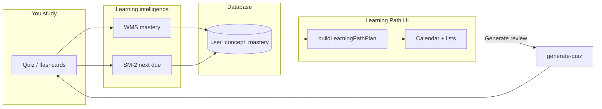

# Learning Path — Beginner’s Guide

This guide explains **how EduCoach turns your performance and deadlines into a study plan** you see on the calendar and lists—not just static dates, but **what to review next** and **when**.

For a shorter, code-heavy reference, see [architecture-learning-path.md](./architecture-learning-path.md).

---

## Who this is for

Anyone asking: *“Where do due dates come from, and why does the app suggest certain quizzes or reviews?”*

---

## The big idea in one sentence

The Learning Path **combines** your profile (how long you study), your **mastery** per concept (from past quizzes/flashcards), **spaced repetition** schedules (SM-2), **adaptive tasks**, and **goals/deadlines** into one **plan** the UI can show and act on.

---

## Why it exists

Without a plan, students see a pile of materials but not **the next best action**. The path tries to:

- Surface what is **due** or **weak**.
- Respect **exam dates** and **quiz deadlines** when you set them.
- Trigger **targeted review quizzes** when the plan says it is time.

---

## Key terms (simple)

| Term | Meaning |
|------|--------|
| **Concept** | A topic extracted from your material; mastery is tracked per concept. |
| **WMS (Weighted Mastery Score)** | A score (0–100 style) from your **recent** attempts, weighted by difficulty and time. |
| **Confidence** | How much evidence we have (more attempts → more confidence in the score). |
| **Final mastery** | Blends raw score with a neutral baseline so **one lucky guess** does not mean “mastered.” |
| **Mastery level** | Bucket: needs review / developing / mastered (uses thresholds + confidence). |
| **SM-2** | Classic spaced repetition: after a review, the **next due date** and **interval** update from how well you did. |
| **Quality (0–5)** | SM-2 input derived from your performance (e.g. quiz score band). |
| **Priority score** | A single “how urgent” number mixing weakness, deadline pressure, and need for more practice. |
| **Display decay** | If you are **overdue**, the **shown** mastery can dip slightly to nudge you—stored mastery updates only when you study again. |
| **Adaptive study task** | A scheduled unit (quiz, flashcards, review) with concept IDs and status (e.g. needs generation). |
| **Plan builder** | Pure client logic: `buildLearningPathPlan` merges DB rows into calendar items. |

---

## The workflow — data side (what updates when you study)

### Step 1 — You answer questions

1. You complete a quiz or flashcard session tied to concepts.

### Step 2 — Results are processed

2. The app runs **`useProcessQuizResults`** (client + database writes).
3. **WMS** recomputes mastery from your latest attempts (recency matters).
4. **Confidence** updates based on how many attempts exist.
5. **SM-2** maps your performance to a **quality** score and computes the next **interval** and **due date** for that concept.
6. **Priority** can be updated for ordering.

### Step 3 — Database reflects the new you

7. Rows in **`user_concept_mastery`** (and related logs) now reflect your new state.

---

## The workflow — planning side (what you see on the path)

### Step 4 — The app loads inputs

8. **`useLearningPathPlan`** fetches:
   - mastery list,
   - adaptive tasks,
   - documents,
   - quizzes,
   - your profile (daily minutes, preferred times, available days).

### Step 5 — Build the plan

9. **`buildLearningPathPlan`** merges these into ordered **items**:
   - **Planned reviews** (from baseline vs performance sources),
   - **Adaptive tasks** (quizzes/flashcards/review with concept lists),
   - **Goal markers** (file goals, quiz deadlines).

10. It assigns **dates** and, where configured, **times** inside your study window.

### Step 6 — You interact

11. Calendar and list UIs show **due today**, **upcoming**, and **adaptive** rows.
12. You can open material, start a quiz, or let the app **auto-start** generation when a task is due (see below).

### Step 7 — Adaptive quiz generation (common path)

13. If an adaptive **quiz** task is **due**, still **needs_generation**, and policy says you need a fresh quiz, the client calls **`useGenerateReviewQuiz`** with:
    - **documentId**,
    - **focusConceptIds** (the weak or scheduled concepts),
    - question count scaled to the number of concepts.

14. That hits **`generate-quiz`** (see the quiz beginner guide). When the quiz is ready, you navigate to take it.

### Step 8 — Loop closes

15. Taking the quiz returns you to **Step 1**; mastery and SM-2 update again.

---

## Visual overview

---

## Mental models that help beginners

1. **The path is not a separate brain.** It is mostly **your data** (mastery + tasks + goals) arranged sensibly.
2. **SM-2 is about memory over time.** Good performance → longer gap until next review; poor performance → reset closer to “review soon.”
3. **Decay on screen is a nudge, not a punishment.** It encourages review when overdue without silently rewriting your stored score.

---

## How this connects to the rest of EduCoach

| Area | Link |
|------|------|
| Quiz generation | Review quizzes use focused concepts from the path |
| Analytics | Same mastery numbers, different visualization |
| Content extraction | Concepts must exist before mastery can attach |

---

## Where the code lives

- Math: `src/lib/learningAlgorithms.ts`
- Plan: `src/lib/learningPathPlan.ts`, `src/hooks/useLearningPathPlan.ts`
- Results processing: `src/hooks/useLearning.ts`
- Page: `src/pages/LearningPathPage.tsx`, `src/components/learning-path/*`

---

## Related reading

- [docs/info/learning_path_explained.md](../info/learning_path_explained.md)
- [beginners-guide-quiz-generation.md](./beginners-guide-quiz-generation.md)
- [beginners-guide-analytics.md](./beginners-guide-analytics.md)
