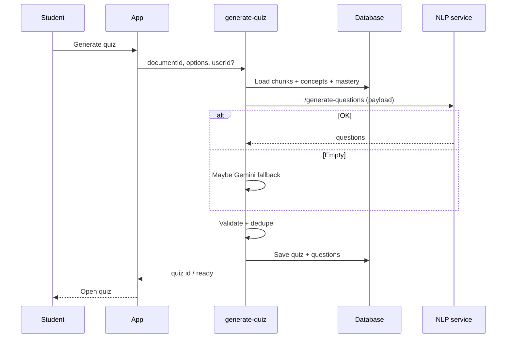

# Quiz Generation — Beginner’s Guide

This guide explains **how EduCoach builds a quiz from your processed document**: where questions come from, how the app keeps them tied to your material, and what “adaptive” means.

For a shorter, code-heavy reference, see [architecture-quiz-generation.md](./architecture-quiz-generation.md).

---

## Who this is for

Anyone asking: *“I pressed ‘generate quiz’—what is the app doing, and why are some quizzes harder or focused on weak topics?”*

---

## The big idea in one sentence

The app reads your saved **chunks** and **concepts**, asks the **NLP service** to turn real sentences into questions (templates, not wild guesses), optionally adjusts for your **mastery**, filters bad questions, saves a **quiz** in the database, and only uses **Gemini alone** if the NLP path returns nothing.

---

## Why this design

- **Grounding:** Questions should come from **your** notes, not generic trivia.
- **Speed & cost:** Template-based generation (AQG) is cheaper than always calling a huge model for every question.
- **Fairness:** Validation removes broken formats (e.g. malformed multiple choice).
- **Personalization:** If the system knows you are weak on topic X, it can emphasize X (when mastery data exists).

---

## Key terms (simple)

| Term | Meaning |
|------|--------|
| **Edge function `generate-quiz`** | Cloud code that runs the whole quiz job. |
| **Chunk** | A passage from your document already stored in the DB. |
| **Concept** | A labeled topic from your document; quizzes can target specific concepts. |
| **AQG (automatic question generation)** | Rule/template-based question building from sentences + keyphrases. |
| **NLP `/generate-questions`** | The NLP service endpoint that performs AQG. |
| **KeyBERT (here)** | If a chunk lacks keyphrases, the service can extract them on the fly for better blanks/options. |
| **Mastery / `user_concept_mastery`** | Per-user scores per concept; used to pick easier vs harder question styles. |
| **Focus / review quiz** | A quiz limited to certain **concept IDs** (common from the learning path). |
| **Question types** | e.g. multiple choice, true/false, fill-in-blank, short identification. |
| **Safety gate** | Code that drops duplicate or invalid questions before saving. |
| **Gemini fallback** | If NLP returns zero questions, Gemini may generate a full quiz instead. |

---

## The workflow (step by step)

### Phase 1 — You request a quiz

1. In the app you choose a document (and options like number of questions and types).
2. The client calls **`generate-quiz`** with at least the **document id** and preferences.

### Phase 2 — Load source material

3. The edge function loads **chunks** and **concepts** for that document from PostgreSQL.
4. If the request includes **focus concept IDs** (review mode), the concept list is narrowed to those topics.

### Phase 3 — Load your mastery (optional but powerful)

5. If the app knows your user id, it reads **`user_concept_mastery`** for those concepts.
6. It derives an **adaptive difficulty** per concept (e.g. weaker mastery → “beginner” style weighting).
7. It may **raise** how many questions come from chunks that contain **weak** concepts, and **lower** quotas for chunks where you already score high.

### Phase 4 — Build the NLP payload

8. For each chunk, the function collects **text**, **keyphrases** (from concept names/keywords), and **important sentences** (sentences that mention those keyphrases).
9. It adds **question type targets** (balanced counts per type) and overall difficulty.
10. If mastery was loaded, it attaches **`mastery_context`** so the NLP service can align difficulty with your level.

### Phase 5 — Call the NLP service (primary path)

11. The function POSTs JSON to **`/generate-questions`** on the NLP service.
12. The service walks important sentences, uses keyphrases to build MCQ/fill-in/identification/etc., and uses **spaCy** for linguistic checks (e.g. is this sentence suitable for true/false).

### Phase 6 — Fallback if NLP returns nothing

13. If the NLP service is down or returns no questions **and** Gemini is configured, the edge function may call **Gemini-only** generation using your chunks and concepts.

### Phase 7 — Clean-up and save

14. Questions are **deduplicated** and **validated** (types, lengths, severe failure flags, identification shape, etc.).
15. A **quiz** row is created (status moves from generating to ready).
16. **Questions** are inserted and linked to the quiz (and concept linkage as designed).

### Phase 8 — You take the quiz

17. Attempts are recorded; later, **mastery** and **SM-2** schedules update (see the learning path and analytics guides). That new mastery feeds the **next** adaptive generation.

---

## Visual overview

---

## “Adaptive” in plain language

- The app does **not** magically read your mind; it reads **stored mastery** from past attempts.
- **Weak areas** tend to get **more** question opportunities from the relevant passages.
- **Strong areas** may get **fewer** questions from those passages so study time goes where it helps most.

---

## How this connects to the rest of EduCoach

| Feature | Link |
|---------|------|
| Content extraction | Must run first so chunks and concepts exist |
| Learning path | Can trigger **review** quizzes with `focusConceptIds` |
| Analytics | Quiz results update mastery you see in charts |

---

## Where the code lives

- `supabase/functions/generate-quiz/index.ts`
- `nlp-service/main.py` (search for `/generate-questions`)

---

## Related reading

- [beginners-guide-content-extraction.md](./beginners-guide-content-extraction.md)
- [beginners-guide-learning-path.md](./beginners-guide-learning-path.md)
- [architecture-quiz-generation.md](./architecture-quiz-generation.md)
