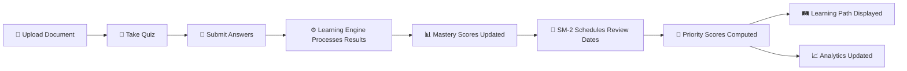
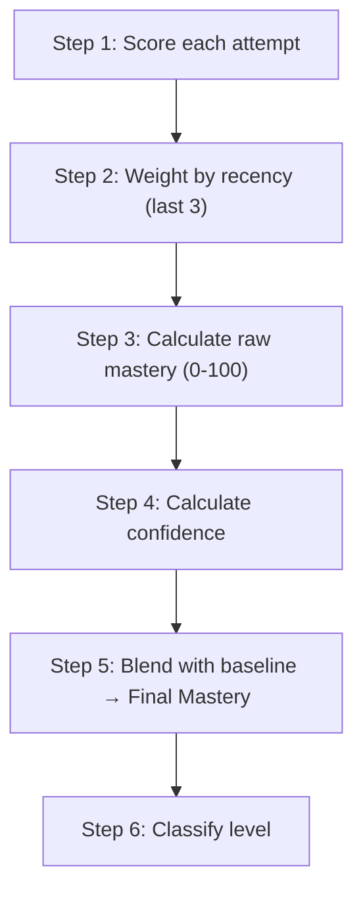
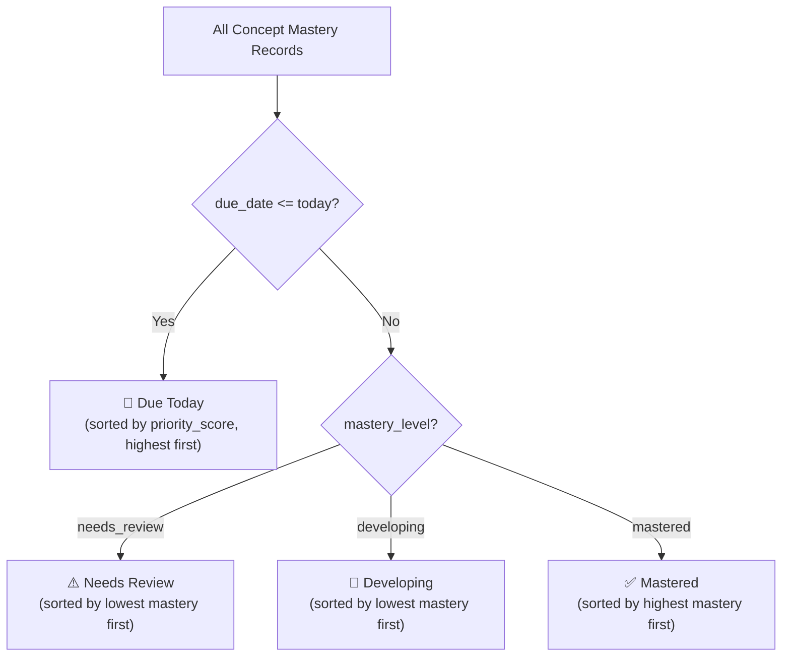
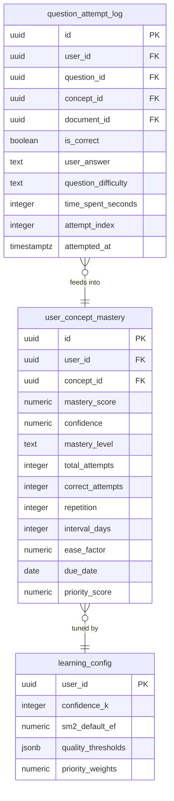

# How the EduCoach Learning Path Works — A Complete Walkthrough

> [!NOTE]
> This document explains the **entire pipeline** from "user takes a quiz" all the way to "personalized learning path appears on screen," including the analytics layer. Written so you can understand every step without needing to reverse-engineer the code.

---

## 🗺️ The Big Picture (30-Second Version)



**In plain English:** You upload study materials -> take quizzes on them -> every answer you give is logged -> three algorithms (WMS, SM-2, Priority Scheduler) crunch the numbers -> EduCoach identifies what needs work -> targeted quizzes, flashcards, and review sessions should be generated around those weak areas -> your personalized learning path and analytics update automatically.

---

## 📁 The Key Files Involved

| File | Role |
|------|------|
| [QuizView.tsx](../../src/components/quizzes/QuizView.tsx) | Where the user takes quizzes — triggers the learning engine on submit |
| [learningAlgorithms.ts](../../src/lib/learningAlgorithms.ts) | Pure math functions — WMS, SM-2, Priority Score (zero side effects) |
| [useLearning.ts](../../src/hooks/useLearning.ts) | React Query hooks — reads/writes to Supabase, orchestrates the pipeline |
| [LearningPathContent.tsx](../../src/components/learning-path/LearningPathContent.tsx) | The Learning Path page — displays the prioritized topic list |
| [AnalyticsContent.tsx](../../src/components/analytics/AnalyticsContent.tsx) | The Analytics page — charts, heatmaps, drill-downs |

---

## 🔄 Step-by-Step: What Happens When You Submit a Quiz

### Step 1: Quiz Submission Triggers the Learning Engine

When the user hits "Submit" in `QuizView.tsx`, two things happen back-to-back:

```
submitAttempt.mutate(attemptData, {
    onSuccess: (attempt) => {
        processQuizResults.mutate({
            attemptId: attempt.id,
            quizId, answers, questions, documentId,
            timePerQuestion   // ← tracked per question
        })
    }
})
```

1. **`submitAttempt`** — saves the attempt to the `attempts` table (score, answers)
2. **`processQuizResults`** — feeds every answer into the learning intelligence engine

> [!IMPORTANT]
> The learning engine runs entirely **client-side** in the browser. No Edge Functions needed. All the math happens in TypeScript, then results are saved to Supabase.

### Step 2: Fan Out Per-Question Logs

Inside [useProcessQuizResults](../../src/hooks/useLearning.ts#527-678), the mutation does this:

1. **Resolves concept IDs** — each quiz question is linked to a [concept](../../src/lib/learningAlgorithms.ts#313-325). If `concept_id` is missing on the question, it tries to resolve it via `source_chunk_id → concept` mapping, or falls back to the document's most important concept.

2. **Computes `attempt_index`** — queries existing logs to figure out "this is the Nth time the user has answered a question about this concept."

3. **Inserts rows into `question_attempt_log`** — one row per question answered:

| Field | What it stores |
|-------|---------------|
| `user_id` | Who answered |
| `question_id` | Which question |
| `concept_id` | Which concept the question tests |
| `is_correct` | Got it right? |
| `question_difficulty` | beginner / intermediate / advanced |
| `time_spent_seconds` | How long the user spent on this question |
| `attempt_index` | Nth attempt for this concept |

### Step 3: Group by Concept, Run the Algorithms

After logging, the mutation groups all answers by `concept_id` and for **each concept**:

1. Calculates the concept's quiz accuracy ([conceptAccuracyPercent](../../src/lib/learningAlgorithms.ts#313-325))
2. Maps that accuracy to an SM-2 quality rating (0–5)
3. Calls [recomputeConceptMastery()](../../src/hooks/useLearning.ts#435-524) which runs the full pipeline ↓

---

## 🧮 The Three Algorithms Explained

### Algorithm 1: WMS (Weighted Mastery Score)

**Purpose:** "How well does this student know this specific concept?"

The WMS pipeline runs 5 steps:



#### Step 1 — Attempt Score (per question)
```
AttemptScore = Correct × DifficultyWeight × TimeWeight
```

- **Wrong answer** → score = 0 (no partial credit)
- **Correct + beginner** → 1.0
- **Correct + intermediate** → 1.1
- **Correct + advanced** → 1.2
- **Time bonus/penalty:**
  - ≤15 seconds → 1.1× bonus (fast and correct = impressive)
  - 15–30s → 1.05×
  - 30–60s → 1.0× (neutral)
  - 60–120s → 0.95×
  - >120s → 0.85× (took too long)
- Score is capped at 1.0 max

#### Step 2+3 — Topic Mastery (weighted average of last 3 attempts)

Only the **most recent 3 attempts** for a concept matter. Older attempts get lower weight:

| Attempt | Recency Weight |
|---------|---------------|
| Most recent | 1.00 |
| 2nd most recent | 0.85 |
| 3rd most recent | 0.70 |

```
Raw Mastery = 100 × Σ(AttemptScore × RecencyWeight) / Σ(RecencyWeight)
```

**Why only 3?** This is intentional — it means the system reacts quickly to improvement. If you bombed a concept last week but nailed it today, your mastery score reflects your current understanding, not your historical average.

#### Step 4 — Confidence

```
Confidence = min(1, attemptCount / 3)
```

| Attempts | Confidence |
|----------|-----------|
| 1 | 0.33 (33%) |
| 2 | 0.67 (67%) |
| 3+ | 1.00 (100%) |

**Why?** This prevents one lucky correct answer from showing "Mastered." You need at least 3 data points before the system is confident in its assessment.

#### Step 5 — Final Mastery (blended with baseline)

```
Final Mastery = confidence × rawMastery + (1 − confidence) × 50
```

**The baseline of 50** acts as a safety net:
- 1 attempt, got it right (raw = 100): Final = 0.33 × 100 + 0.67 × 50 = **66.5%** (not "mastered" yet!)
- 2 attempts, both right: Final = 0.67 × 100 + 0.33 × 50 = **83.5%** (getting there)
- 3 attempts, all right: Final = 1.0 × 100 + 0 × 50 = **100%** (confirmed mastery)

#### Step 6 — Mastery Level Classification

| Level | Criteria |
|-------|---------|
| **🟢 Mastered** | Final Mastery ≥ 80 **AND** Confidence ≥ 0.67 |
| **🟡 Developing** | Final Mastery 60–79 |
| **🔴 Needs Review** | Final Mastery < 60 |

> [!TIP]
> Notice that even with a perfect score, you can't reach "Mastered" with just 1 attempt because confidence only reaches 0.33, which is below the 0.67 threshold. **You need at least 2 perfect attempts** (confidence = 0.67) with a high enough final score.

---

### Algorithm 2: SM-2 (Spaced Repetition Scheduling)

**Purpose:** "When should this student review this concept next?"

SM-2 is a classic spaced repetition algorithm (the same one Anki uses). It schedules review dates based on how well you performed.

#### Quality Rating Mapping

The concept's quiz accuracy gets mapped to an SM-2 quality (0-5):

| Accuracy | Quality | Meaning |
|----------|---------|---------|
| ≥ 90% | 5 | Perfect recall |
| 80–89% | 4 | Correct with hesitation |
| 65–79% | 3 | Correct with difficulty |
| 50–64% | 2 | Incorrect but close |
| 30–49% | 1 | Incorrect |
| < 30% | 0 | Blackout |

#### The SM-2 Algorithm

- **Quality ≥ 3** (you knew it) → advance the schedule:
  - First success: review in **1 day**
  - Second success: review in **6 days**
  - Further successes: `interval = previous_interval × ease_factor`
  - Ease factor gets updated: `EF' = EF + (0.1 - (5-q)(0.08 + (5-q)*0.02))`
  
- **Quality < 3** (you didn't know it) → **reset to day 1**
  - The interval goes back to 1 day
  - Ease factor still adjusts (minimum 1.3)

#### Example SM-2 Progression

| Quiz # | Score | Quality | Interval | Next Review |
|--------|-------|---------|----------|-------------|
| 1 | 85% | 4 | 1 day | Tomorrow |
| 2 | 90% | 5 | 6 days | Next week |
| 3 | 75% | 3 | ~15 days | In 2 weeks |
| 4 | 40% | 1 | **1 day** | Tomorrow (RESET!) |
| 5 | 95% | 5 | 1 day | Tomorrow (rebuilding) |

---

### Algorithm 3: Priority Score (Global Scheduler)

**Purpose:** "Of all the concepts to study, which ones should the student focus on FIRST?"

```
Priority = 0.65 × (1 − mastery/100) + 0.25 × deadlinePressure + 0.10 × (1 − confidence)
```

| Component | Weight | What it measures |
|-----------|--------|-----------------|
| **Weakness** | 65% | Lower mastery = higher priority |
| **Deadline Pressure** | 25% | How overdue/close to due the review is |
| **Low Practice** | 10% | Less practice = higher priority |

**Deadline Pressure** is calculated as:
```
deadlinePressure = max(0, min(1, 1 - daysUntilDue/14))
```
- Overdue → pressure = 1.0 (maximum)
- Due today → pressure = 1.0
- Due in 7 days → pressure = 0.5
- Due in 14+ days → pressure = 0.0

The result is a **0–1 score** where **higher = study sooner**.

---

## 🔢 How Many Quizzes Does It Take?

> [!IMPORTANT]
> **There is no fixed number of quizzes.** The learning path starts building from your **very first quiz**. But here's what the math tells us about when things become meaningful:

### Per Concept (not per quiz):

| Attempts on a concept | What happens |
|-----------------------|-------------|
| **1 correct answer** | Concept appears on learning path as "Developing" (~66% mastery, 33% confidence) |
| **2 correct answers** | Moves toward "Mastered" (~83% mastery, 67% confidence). Meets confidence threshold! |
| **3 correct answers** | Reaches full confidence. If all correct, shows "Mastered" (100%) |
| **1 wrong answer** | Concept appears as "Needs Review" (~33% mastery after confidence blending) |

### Per Quiz:
A typical quiz covers **multiple concepts**. So one quiz with 10 questions might update 3-5 different concepts at once. That means:

- **1 quiz** = your learning path has initial data (but low confidence on each concept)
- **2-3 quizzes on same material** = confidence is high enough to trust the scores
- **Ongoing quizzes** = SM-2 adjusts review schedules, mastery fluctuates based on performance

> [!TIP]
> The system also integrates **flashcard reviews** (not just quizzes). When you review flashcards linked to concepts, those also update mastery scores through the same [recomputeConceptMastery](../../src/hooks/useLearning.ts#435-524) function. So flashcards + quizzes both feed into the same learning path.

---

## Adaptive Study Generation

The learning path should act as an **active planner**, not just a reporting screen.

Once EduCoach identifies weak, overdue, or still-developing concepts, it should turn those findings into new study work:

1. **Targeted quizzes**
   - Generate quizzes weighted toward weak concepts or overdue review topics.
   - Reduce emphasis on already-mastered concepts unless spaced repetition says they are due again.

2. **Targeted flashcards**
   - Create flashcards for repeated recall on the same weak concepts.
   - Use them as lighter-weight follow-up practice between larger quizzes.

3. **Review sessions**
   - Group due or weak concepts into review blocks that can be scheduled on the learning path.
   - Use the student's availability, deadlines, and review urgency to decide when they should appear.

4. **Continuous replanning**
   - Every time the student completes a quiz, flashcard session, or review, the mastery engine runs again.
   - The next generated study set should change based on the latest mastery, confidence, and due-date data.

This means the product goal is a closed loop:

`performance data -> weakness detection -> generated study work -> scheduled learning path -> new performance data`

---

## 🛤️ How the Learning Path Page Displays Data

The [LearningPathContent.tsx](../../src/components/learning-path/LearningPathContent.tsx) component pulls data from two hooks:

1. **[useConceptMasteryList()](../../src/hooks/useLearning.ts#160-210)** — all concept mastery records with concept names and document titles
2. **[useLearningStats()](../../src/hooks/useLearning.ts#251-336)** — aggregated stats (totals, averages, streak)

### The Four Priority Sections

The component sorts all concepts into four groups:



1. **🎯 Due Today** — Topics where `due_date ≤ today`. Sorted by priority score (most urgent first). These are overdue or due-now SM-2 reviews.
2. **⚠️ Needs Review** — Topics with mastery < 60% (that aren't already in "Due Today"). Sorted weakest first.
3. **📖 Developing** — Topics with mastery 60–79%. Still learning. Sorted weakest first.
4. **✅ Mastered** — Topics with mastery ≥ 80% and confidence ≥ 67%. Sorted strongest first.

### Summary Stats (Top Cards)

| Card | Data Source |
|------|-----------|
| Due Today count | Filtered from mastery list where `due_date <= today` |
| Needs Review count | From [useLearningStats().needsReviewCount](../../src/hooks/useLearning.ts#251-336) |
| Developing count | From [useLearningStats().developingCount](../../src/hooks/useLearning.ts#251-336) |
| Mastered count | From [useLearningStats().masteredCount](../../src/hooks/useLearning.ts#251-336) |

### Overall Readiness Bar

Shows `averageMastery` across ALL tracked concepts as a progress bar with percentage.

### Each Topic Card Shows:

- **Concept name** + mastery level badge (🟢/🟡/🔴)
- **Mastery %** progress bar
- **Confidence %** 
- **Days until due** (with red text if overdue)
- **Source document name**
- **"Review" button** linking to the source document

---

## 📈 Analytics — How It All Gets Visualized

The [AnalyticsContent.tsx](../../src/components/analytics/AnalyticsContent.tsx) page provides multiple views into the same underlying data:

### Overview Stats (4 cards at top)

| Stat | Source | What it means |
|------|--------|---------------|
| **Concepts Tracked** | [useLearningStats().totalConcepts](../../src/hooks/useLearning.ts#251-336) | Total unique concepts with mastery data (broken down: mastered / developing / needs review) |
| **Quizzes Completed** | [useLearningStats().quizzesCompleted](../../src/hooks/useLearning.ts#251-336) | Count of completed attempts from `attempts` table |
| **Average Score** | [useLearningStats().averageScore](../../src/hooks/useLearning.ts#251-336) | Mean score across all quiz attempts |
| **Study Streak** | [useLearningStats().studyStreak](../../src/hooks/useLearning.ts#251-336) | Consecutive UTC days with at least one quiz attempt |

### Study Activity Heatmap

- **Hook:** [useStudyActivity()](../../src/hooks/useLearning.ts#396-432)
- **Data:** Queries `question_attempt_log` for the last **90 days**, counts questions per day
- **Display:** GitHub-style green heatmap, 5 intensity levels (0 = gray, 1-4 = green shades)
- **Purpose:** Shows consistency of study habits at a glance

### Tab 1: Performance

Three sub-sections:

1. **Performance by Document** — Horizontal bar chart (Recharts `BarChart`) showing average mastery per uploaded document. Grouped by `document_id`, all concept scores for that document are averaged.

2. **Mastery Distribution** — Donut pie chart (Recharts `PieChart`) showing the count of Mastered (green) / Developing (yellow) / Needs Review (red) concepts.

3. **All Concepts List** — Clickable rows for every tracked concept. Click one to open the **Concept Drill-Down** view showing:
   - Mastery % and Confidence %
   - Total attempts and correct attempts
   - SM-2 due date and current interval
   - Ease factor
   - Concept category

### Tab 2: Trends

- **Hook:** [useScoreTrend()](../../src/hooks/useLearning.ts#344-388)
- **Data:** Daily average quiz scores from the `attempts` table for the last **30 days**
- **Display:** Recharts `LineChart` showing score over time
- **Purpose:** Shows whether you're improving, plateauing, or declining

### Tab 3: Weak Topics

- **Hook:** [useWeakTopics(10)](../../src/hooks/useLearning.ts#237-250)
- Lists concepts with `mastery_level = 'needs_review'`, sorted by lowest mastery first
- Each topic is clickable → opens the concept drill-down
- Shows: concept name, document, category, mastery %, attempt count, confidence %

### Tab 4: Quiz History

- **Hook:** `useUserAttempts()` + `useQuizzes()`
- Shows the 10 most recent completed quiz attempts
- Each entry shows: quiz title, correct/total, date, and score with color coding (green ≥80%, yellow ≥60%, red <60%)

---

## 🗂️ Database Tables Summary



- **`question_attempt_log`** — Raw data. Every question answered = one row. This is the foundation.
- **`user_concept_mastery`** — Computed state. One row per user×concept. Stores WMS output + SM-2 state + priority score.
- **`learning_config`** — Tunable parameters per user. Falls back to defaults if no row exists.

---

## 🔁 Sources That Feed Into the Learning Path

The learning path isn't just fed by quizzes. Multiple study activities should feed mastery and future planning:

| Source | How it works |
|--------|-------------|
| **Quizzes** | [useProcessQuizResults](../../src/hooks/useLearning.ts#527-678) mutation runs after every quiz submission. Inserts log rows, runs WMS + SM-2 per concept. |
| **Flashcard Reviews** | `useReviewFlashcard` in `useFlashcards.ts` — after rating a flashcard (SM-2 quality), it inserts a `question_attempt_log` entry and calls [recomputeConceptMastery](../../src/hooks/useLearning.ts#435-524). |
| **Scheduled Review Sessions** | Review activities placed on the learning path should also update the same mastery records once they produce student performance data. |

All of these study activities should converge on the **same mastery engine** so the next generated quizzes, flashcards, and review sessions reflect the student's latest performance.

---

## ⚡ Quick Reference: Realistic Scenario

Say a student uploads their "Data Structures" lecture notes. The NLP pipeline extracts 5 concepts: *Arrays, Linked Lists, Stacks, Queues, Trees*.

**Quiz 1 (10 questions):**
- Gets Arrays questions all correct → Arrays: ~66% mastery (low confidence)
- Gets Linked Lists questions mostly wrong → Linked Lists: ~39% mastery (needs_review)
- Gets Stacks right → Stacks: ~66% mastery

**After Quiz 1, Learning Path shows:**
- 🎯 Due Today: All 3 concepts (first review is scheduled for tomorrow, everything starts due immediately)
- ⚠️ Needs Review: Linked Lists (lowest score)
- 📖 Developing: Arrays, Stacks

**Quiz 2 (same material, next day):**
- Arrays: correct again → confidence now 0.67, mastery ~83% → **Mastered!** 🎉
- Linked Lists: correct this time → mastery improves to ~55% → still needs_review but improving
- Queues: new concept, correct → ~66% developing

**After Quiz 2, Learning Path shows:**
- ✅ Mastered: Arrays (interval now 6 days, next review in 6 days)
- 📖 Developing: Stacks, Queues
- ⚠️ Needs Review: Linked Lists (priority score is highest — study this first!)

**The system keeps adapting with every quiz, flashcard review, and scheduled review activity.**
