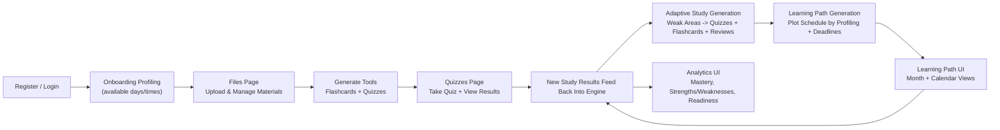

# EduCoach User Flow (End-to-End)

This document describes the user-facing workflow of EduCoach: from registration and profiling, to studying uploaded materials, to generating quizzes and flashcards, and finally to producing an adaptive learning path and analytics loop.

## 1. Register / Login

1. The user registers (or logs in).
2. During onboarding, the user completes a profiling step.
3. Profiling captures the user’s:
   - Preferred / available study days
   - Preferred / available study time (time-of-day windows)
4. These preferences are used to build (and later re-build) the student’s learning path schedule.

> Users can update their profiling (study days/times) later in Account Settings / Profile.
> In Profile, users can also update daily study minutes and manually trigger **Replan Learning Path**.

## 2. Upload Study Materials (Files Page)

1. The user navigates to the `Files` page.
2. The user uploads one or more study files/materials.
3. The user can view the content of uploaded files.
4. The user can interact with uploaded materials through studying features, such as:
   - Annotating
   - Taking notes
   - Highlighting
5. The user can delete uploaded files.

## 3. Generate Flashcards and Quizzes (From Uploaded Files)

### 3.1 Flashcards

- The user can generate flashcards from the uploaded file(s).
- Generated flashcards are then available for study.
- These flashcards can also become part of the student's later review plan when weak concepts are identified.

### 3.2 Quizzes

1. The user generates a quiz from the uploaded file(s).
2. A modal appears with a quiz configuration form where the user can select:
   - Quiz type(s)
   - Number of items
   - Difficulty level
   - Bloom’s taxonomy focus (top-level implementation, exact mapping TBD)
3. The user clicks `Generate Quiz`.
4. The quiz is created and then appears in the `Quizzes` page.

#### Quiz Deadline

- When creating a quiz, the user can set a deadline for completing it.

### 3.3 Automated Review Generation

Once enough student performance data exists, EduCoach should also generate study activities automatically instead of relying only on manual generation.

- The system identifies weak, overdue, or still-developing concepts.
- Based on those concepts, EduCoach should automatically create:
  - targeted quizzes
  - targeted flashcards
  - review-focused study sessions
- These generated activities should be attached to the student's learning path and scheduled using the student's availability and deadlines.

### 3.4 Baseline Quiz After Upload (Current Behavior)

- Immediately after successful document processing, EduCoach auto-starts baseline quiz generation.
- The UI shows kickoff feedback: baseline quiz generation has started.
- The first generated quiz uses a balanced diagnostic mix and keeps fill-in-the-blank usage lower than other types.
- Manual quiz generation remains available and independent.

## 4. Study and Take Quizzes (Quizzes Page)

The `Quizzes` page displays the student’s quizzes and studying items, typically grouped as:
- Available quizzes
- Completed quizzes (history)
- Flashcards (study sessions)
- Generated review work

### 4.1 Taking a Quiz

1. The student opens an available quiz.
2. The student answers questions and submits the attempt.
3. The student views quiz results after submission.

### 4.2 Reviewing Results

- The student can review their quiz history in the `Completed` tab.

### 4.3 Studying with Flashcards

- The student can practice using generated flashcards.
- Flashcard results (reviews) are tracked similarly to quiz performance and feed into the learning intelligence pipeline.
- The same concept data should be used to refresh later quizzes, flashcards, and review sessions.

## 5. Learning Intelligence -> Learning Path + Analytics

After quiz attempts and flashcard reviews, EduCoach processes the student’s performance to update:
- Mastery levels
- Strengths and weaknesses
- Readiness
- Overall performance trends
- Additional analytics as defined by the system

### Learning Path (Personalized, Scheduled)

1. Based on the processed analytics, EduCoach generates a learning path.
2. A learning path is a suggested study path that aims to improve:
   - Topic mastery
   - Readiness
   - Knowledge coverage
   - Performance over time
3. The learning path is plotted into the student’s schedule using their profiling:
   - Preferred / available days and times
   - The quiz/assessment deadlines (and the learning path timeframe)
4. The learning path should not only display weak topics. It should actively convert them into scheduled work:
   - Auto-generated quizzes focused on weak or developing concepts
   - Auto-generated flashcards for repeated recall on those same concepts
   - Review sessions that reinforce overdue or low-mastery topics
5. As the student completes those generated activities, EduCoach should reprocess the new results and update:
   - Mastery scores
   - The next set of recommended quizzes / flashcards / reviews
   - The learning path schedule itself

### Scheduling Constraint: User Availability Changes

Because the learning path is built on a scheduled timeframe derived from profiling, there can be times when the student cannot take assessments (for example, sudden unavailability).

- If this happens, the user can move the scheduled assessment(s) to a day/time where they are available.
- The rescheduling should take the updated availability into account while preserving the overall deadline constraints.
- Profile now supports two replanning paths:
  - **Automatic replanning on save** when availability fields are edited.
  - **Manual replanning button** ("Replan Learning Path") for explicit re-run.
- Replanning should show progress and report partial success when some goal-dated documents fail to update.

## 6. Learning Path Views (Month + Calendar)

- The learning path is displayed with both:
  - Month view
  - Calendar view
- Scheduled activities appear as time-based items (e.g., assessments and practice sessions) that align with the student’s profiling and updated schedule.
- As adaptive study items are regenerated, the calendar and month views should also refresh to reflect the latest priorities.
- In schedule/calendar view, quiz task clicks provide status feedback/routing; they do not silently fail.

## 7. Analytics

- The Analytics section shows the student’s analytics and performance metrics.
- This includes the computed learning intelligence outcomes (mastery, readiness, strengths/weaknesses, and other measured statistics).

## 8. High-Level Flow Diagram

## 9. Summary (What the Student Experiences)

- Set up availability during onboarding.
- View and edit availability later in Profile (days, study window, daily minutes).
- Upload materials and study them directly with annotations.
- Generate flashcards and quizzes from uploaded content.
- Get a baseline diagnostic quiz automatically after upload processing.
- Take quizzes and practice with flashcards.
- EduCoach processes results, identifies weak or developing concepts, and should automatically generate targeted quizzes, flashcards, and review work around them.
- Those generated study items are placed on the learning path and re-planned as the student produces more results.
- Adjust schedule when availability changes using Profile save or manual replan, then follow the month/calendar plan.
- Track progress and insights in analytics.

